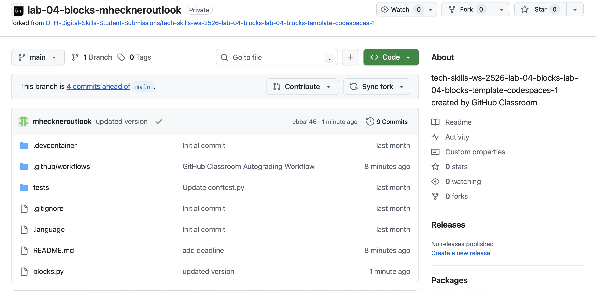

Note Challenge

FAQ & Troubleshooting

[[toc]]

# Allgemeines und Organisatorisches

## Wie Viele Punkte erhalte ich auf die Challenges?
Die Punkte für den praktischen Leistungsnachweis verteilen sich wie folgt auf die Challenges:

* IT-Infrastruktur: 5
* Scratch: 7
* Python 1: Hello	2
* Python 1: Blocks	7
* Python 2: Phone Book	7
* SQL: MonstER Park	5
* SQL: Island	5
* KI Einführung: 3
* Web: Homepage: 9
* Cybersecurity: 6
* Digital Wellness: 7

## Was ist ein Bonus?! Wie bekomme ich den?
Sehen Sie sich dazu den Einführungsfoliensatz in ELO an.

# Python und Codespaces
Antworten auf häufige Fragen und Probleme, die während der Arbeit mit Codespaces und beim Abgeben Ihrer Labs auftreten können. Diese Seite gilt für alle Labs im Kurs, nicht nur für ein bestimmtes Thema.

## Mein Codespace sagt, er sei im "Recovery Mode"

Das passiert meistens, wenn eine Eingabe im Terminal gemacht wurde, bevor der Codespace vollständig konfiguriert war. Führen Sie einen Full Rebuild durch:

1. Drücken Sie "Shift + Cmd + P" (Mac) oder "Ctrl + Shift + P" (Windows).
2. Geben Sie in das jetzt erschienene Eingabefeld den folgenden Text ein: ```>Rebuild Container```
3. Bestätigen Sie mit der Taste Enter.

## GitHub meldet, dass ich zu viele "running" Codespaces habe

Es dürfen nur maximal 2 Codespaces gleichzeitig aktiv sein. Die Codespaces stoppen sich normalerweise automatisch 30 Minuten nach der letzten Verwendung. Um einen Codespace manuell zu stoppen, rufen Sie den Link [https://github.com/codespaces/](https://github.com/codespaces/) auf, klicken neben einem Codespace, der als "active" markiert ist, auf die drei Punkte und stoppen dann den Codespace (nicht löschen!).

## Mein Codespace startet nicht richtig / Fehler beim Öffnen

Damit Codespaces funktioniert, belassen Sie die Standardeinstellungen Ihres Browsers bzgl. Sicherheit bitte bei und verschärfen diese nicht (wenn Sie nicht wissen, was dies bedeutet, haben Sie aller Wahrscheinlichkeit nach kein Problem mit Codespaces).

## Wie oft kann ich submitten?

Sie können beliebig oft submitten, es wird jeweils die neueste Version des Codes "hochgeladen". Der letzte ```submit``` vor der Deadline ist Ihre Abgabe.

## Woher weiß ich, ob meine Einreichung mit submit erfolgreich war?

Loggen Sie sich in GitHub ein und rufen Sie die URL [https://github.com](https://github.com) in Ihrem Browser auf. Auf der linken Seite finden Sie pro Aufgabe ein Repository:


Klicken Sie auf das Repository, für das Sie überprüfen wollen, ob die Abgabe funktioniert hat (z.B. ```OTH-Tech-Skills-Classroom50/lab-blocks-ihrgithubusername```). Auf der jetzt geöffneten Seite können Sie Ihren Code überprüfen (hier ```blocks.py```).



Der grüne Haken neben "updated version" zeigt an, dass Sie alle Testfälle bestanden haben. Falls Sie nicht alle Testfälle bestanden haben, steht dort ein rotes Kreuz. Wenn Sie die abgegebene Datei anklicken und den selben Code sehen, den Sie in Codespaces bearbeitet haben, dann bedeutet das, dass die Abgabe über ```submit``` funktioniert hat.
