Note Challenge

Einführung Scratch

[[toc]]

# Scratch Einführung

## Einführung

- Zum Programmieren gibt es verschiedene Sprachen. Die meisten funktionieren so, dass man einen Befehl in Form eines Textes eingibt und dann ausführt.
- Wir lernen heute die Programmiersprache Scratch kennen, bei welcher es vorgefertigte Programmierblöcke gibt, welche sich wie Puzzleteile zusammenfügen lassen.

## Programmierumgebung
Sie entwickeln Scratch auf der folgenden Webseite: 
[https://scratch.mit.edu/projects/editor/?tutorial=getStarted](https://scratch.mit.edu/projects/editor/?tutorial=getStarted)

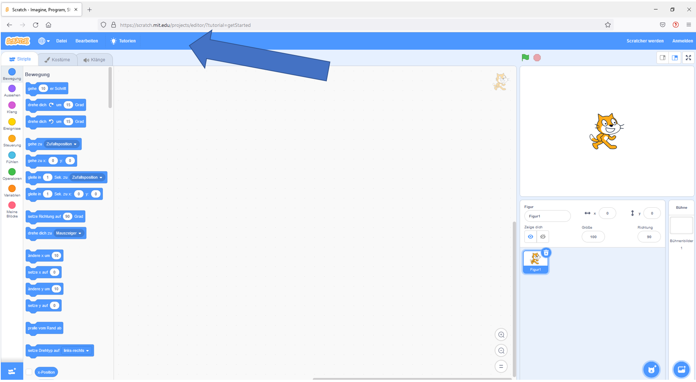

Mit Hilfe der Menüleiste kann das aktuelle Programm z. B. gespeichert werden. 

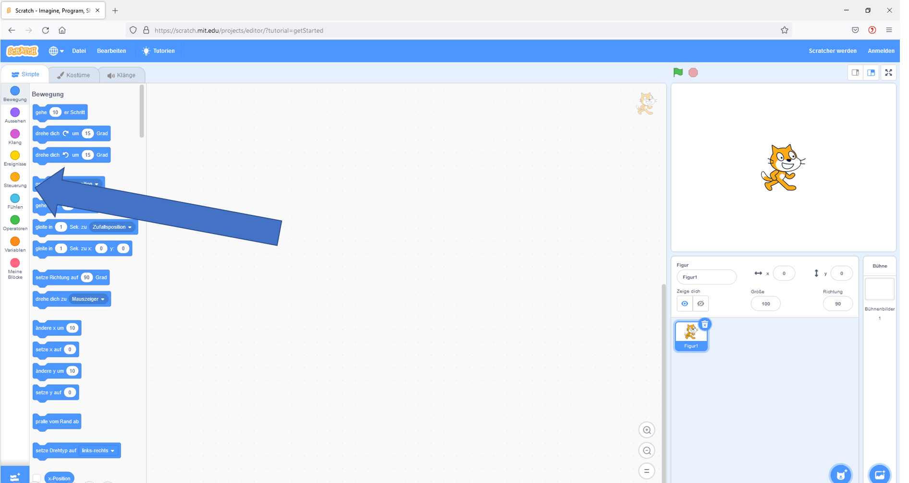

In Scratch sind die Befehle gruppiert. Es gibt z. B. die Gruppe “Bewegen” bzw. “Aussehen”. Zwischen verschiedenen Arten von Befehlen kann in der Leiste links ausgewählt werden. 

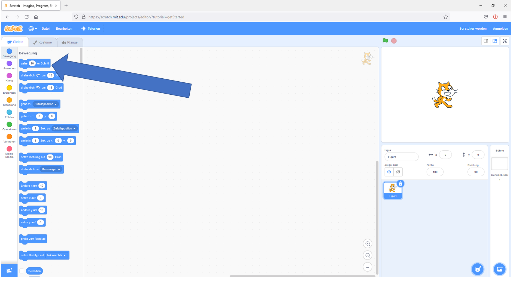

“Gehe 10er Schritte” ist ein konkreter Befehl und zwar der einfachste in Scratch.
Diesen Befehl ziehen wir jetzt in die Mitte, wo die Programme entstehen, also in den Programmierbereich.

## Erste Befehle

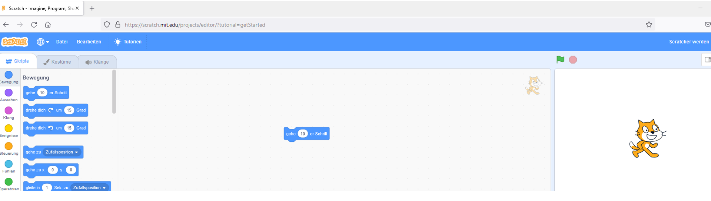

Wenn wir auf den Befehl klicken bewegt sich rechts - im Ausgangsbereich - die Katze. 

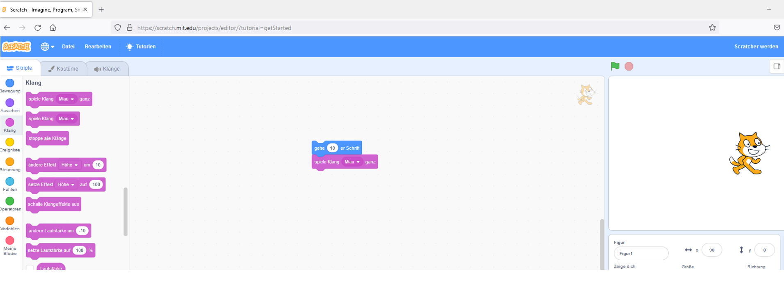

Wollen wir z. B. noch einen Klang abspielen so ziehen wir aus der Gruppierung Klang noch den Befehl “spiele Klang Miau ganz” in den Programmierbereich und hängen diesen Befehl direkt an den Befehl “Gehe 10er Schritte” an. Wir klicken auf die Befehlskette und testen das Programm. 

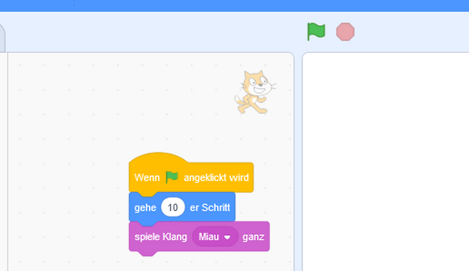

Nun wollen wir den Start des Programms verbessern. Wir gehen in die Befehlsgruppe “Ergebnisse” und finden dort den Befehl “Wenn grüne Fahne angeklickt wird”. Dies ist die Startoption in Scratch und sozusagen ein Randstein, da oberhalb dieses Befehls kein anderer Befehl stehen darf/kann. 

Klicken wir jetzt auf die grüne Fahne (in der blauen Leiste) und unser Programm startet. Das Klicken auf die Befehlsgruppe im Programmierbereich funktioniert immer noch als zweite Möglichkeit.

## Hello World bzw. Hello User

In der Informatik ist es üblich, dass das erste Programm, das man programmiert, “Hello World” ausgibt. Dieses Programm wollen wir nun erstellen. 

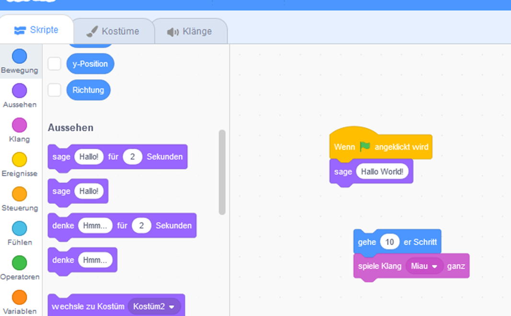

Dazu schieben wir den Gehen- und Miau-Befehl zur Seite und gehen in die Gruppe “Aussehen”. Dort finden wir den Befehl “sage Hallo”. Dieses ziehen wir in den Programmierbereich und hängen ihn an den Startbefehl “Wenn grüne Fahne angeklickt wird” an. Wir ergänzen nach dem “Hallo” das Wort “World!”. Nun sagt die Katze “Hallo World!” nachdem wir die grüne Fahne angeklickt haben.

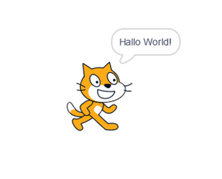

Nun wollen wir den User nach seinem Namen fragen und dann “Hello World - Username” ausgeben. Dazu benötigen wir aus der Gruppe “Fühlen” den Befehl “Frage wie heißt du? und warte”. unter diesem Befehl sehen wir eine Variable, welche Antwort heißt und in einer Ellipse dargestellt ist. Diese Variable aktivieren wir d.h. in der blauen Box ist ein Hacken.

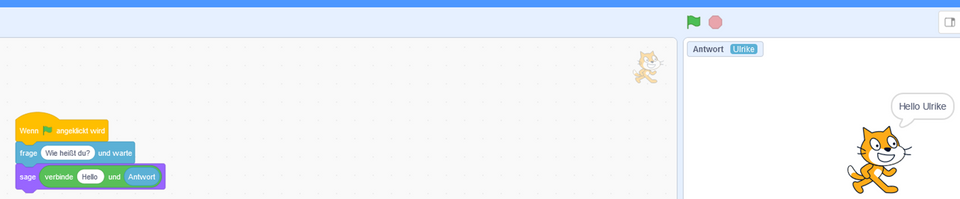

In einer Variable speichert der Computer Werte und kann sie bei Bedarf wieder ausgeben. Wir sehen die Variable oben links über unserer Katze abgebildet und können dort auch sehen, welcher Wert aktuell hinterlegt ist. In diesem Screenshot ist dies “Ulrike”.

Wir wollen nun das Wort “Hello” und den Wert in der Variablen“Antwort” ausgeben. Dazu brauchen wir aus der Gruppe “Operatoren” einen Verbinden-Befehl, da wir aus dem Wort “Hallo” und dem Wort in unserer Variablen eine Zeichenkette machen wollen. Den Befehl zum Verbinden fügen wir in den “Sage”-Befehl ein (siehe Screenshot). Statt “Apfel” und “Banane” benötigen wir die Worte “Hello” bzw. die Variable “Antwort”. Die Variable “Antwort” finden wir in der Gruppe “Fühlen”. Diese ziehen wir auf das Wort “Banane”.  

Wir klicken wieder auf die grüne Fahne und das Programm fragt uns “Wie heißt du?” wir geben unseren Namen ein und sehen, dass der Name in der Variablen gespeichert wird (siehe oberhalb der Katze in dem blauen Feld) anschließend wird in diesem Beispiel “Hello Ulrike” in der Sprechblase ausgegeben.

## Vergleich von zwei Zahlen

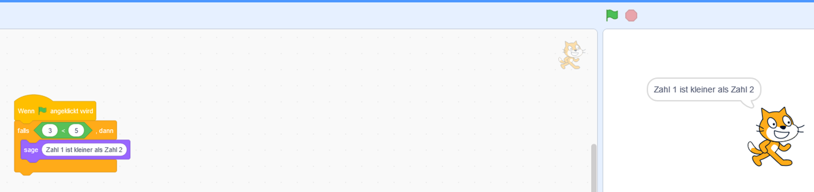

Wir wollen nun ein Programm schreiben das zwei Zahlen miteinander vergleicht. Dazu benötigen wir eine Fallunterscheidung, da mehrere Fälle eintreten können. Eine solche Fallunterscheidung bezeichnet man auch als if-Abfrage. 

In der ersten Version unseres Programms holen wir uns den “Falls ..., dann” Befehl (Gruppe Steuerung) und fügen aus der Gruppe Operatoren den “< Vergleiche-Befehl” ein. Wir geben zwei Zahlen in diesem Beispiel 3 und 5 ein. Aus der Gruppe “Aussehen” holen wir wieder einen “Sage”- Befehl. Und zwar soll in diesem Beispiel ausgegeben werden die “Zahl 1 ist kleiner als Zahl 2”.

Wir klicken auf die grüne Fahne und anschließend gibt unsere Katze “Zahl 1 ist kleiner als Zahl 2” aus.

Ändern wir den Wert der ersten Zahl auf 5 und den Wert der zweiten Zahl auf 3, dann gibt dieses Programm keine Ausgaben aus, da 5 > 3 ist. Dies möchten wir in der nächsten Version unseres Programmes verbessern.

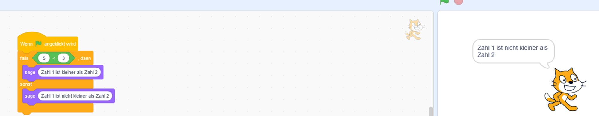

Wir holen uns nun eine “Wenn..., dann ... sonst” - Abfrage, welche auch als “If ... then ... else” Abfrage bezeichnet wird. Diese finden wir wieder in der Gruppe Steuerung. Hier haben wir nun die Möglichkeit, sollte die Bedingung nicht erfüllt sein, einen Sonst-Zweig einzubauen.

Wir ändern den Wert der ersten Zahl von 3 auf 5 ab und den Wert von Zahl zwei 5 auf 3. In der “Sonst”-Abfrage geben wir den Text ein “Zahl 1 ist nicht kleiner als Zahl 2”. Diese Aussage beinhaltet das die Zahl 1 gleich der Zahl 2 ist.

Wir klicken nun wieder auf die grüne Fahne und testen unser Programm. Wir erhalten die Ausgabe “Zahl 1 ist nicht kleiner als Zahl 2” in der Sprechblase der Katze.

Wir können nun weitere Fälle testen wie z. B. den Fall, dass der Wert der ersten Zahl 4 ist und der Wert der zweiten Zahl 6 ist. Wir erhalten wieder die Ausgabe “Zahl 1 ist kleiner als Zahl 2”.

## Schleifen

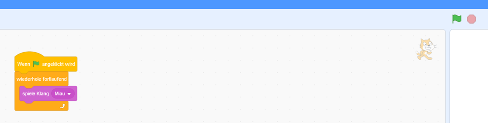

In der Informatik werden neben “If-Abfragen” sehr häufig “Schleifen” eingesetzt. Wir möchten nun noch zwei Befehle kennen lernen.

Wir schieben den bisherigen Code zur Seite und fügen den “spiele Klang Miau” Befehl ein. Wir möchten, dass der Computer nun unendlich diesen Befehl “spiele Klang Miau” abspielt. Dazu holen wir die “wiederhole fortlaufend” - Schleife aus der Gruppe “Steuerung” in unseren Programmierbereich und fügen den “spiele Klang Miau” Befehl ein. 

Wir hören jetzt, so lange bis wir den “Stopp”-Befehl (rechts neben der grünen Fahne) drücken  die Katze miauen. Wir haben somit eine Endlosschleife programmiert.

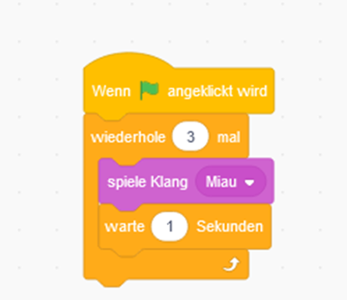

Nun wollen wir die Katze nicht endlos miauen hören, sondern z.B. nur 3 mal. Dazu benötigen wir eine Zählerschleife d.h. ein Zähler zählt mit, wie oft die Schleife bereits durchlaufen worden ist. 

Wir holen den Befehl “Wiederhole ... mal” und gebe dort die Zahl 3 ein. Anschließend ziehen wir den eben verwendeten Befehl “spiele Klang Miau” in die Schleife rein. Damit wir die einzelnen Miaus besser hören können, soll der Computer nach jedem Miau eine Sekunden warten. Diesen Befehl finden wir unter “Steuerung”. 

Nun haben wir zahlreiche Scratch Befehle kennen gelernt.

# Verwendung von bestehenden und eigenen Blöcken in Scratch

## Vorbereitung

Wir wollen das bisher Gelernte nochmals anhand eines Beispiels vertiefen. Unser Ziel ist es, dass sich die Katze auf Knopfdruck im Kreis dreht. Zudem wollen wir mit einer weiteren Taste das Programm wieder in die Ausgangsposition zurücksetzen. Dazu lernen wir sogenannte Custom Blocks, d.h. eigene Blöcke, kennen.

Bei der Programmierung empfiehlt sich grundsätzlich das Vorgehen, die gesamte Aufgabe in mehrere Teilschritte zu zerlegen. Wir programmieren demzufolge einen ersten Schritt und testen anschließend sofort. Dies gibt uns die Möglichkeit, umgehend festzustellen, ob unser Programm wie erwartet funktioniert. Falls dies der Fall ist, programmieren wir den nächsten Teilschritt; falls nicht, lernen wir aus dieser Rückmeldung und passen die Programmierung an. Diese Vorgehensweise hat den Vorteil, dass wir gleich wissen, wo wir bei der Fehlersuche ansetzen müssen und nicht am Schluss einen Fehler in einem langen Code suchen müssen.

Konkret gesagt möchten wir programmieren, dass sich die Katze erst nach links dreht, wenn die „Pfeil-nach-links“-Taste gedrückt wird. Die Drehung nach rechts programmieren wir erst, wenn die Linksdrehung vollständig korrekt funktioniert. D.h. wir zerlegen das Gesamtziel in mehrere Teilziele. 

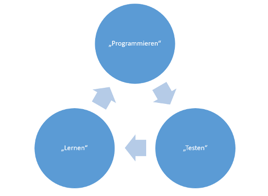

Dazu öffnen wir Scratch und starten mit einer neuen bzw. leeren Programmierumgebung.

## Was wir brauchen

Damit die Katze sich im Kreis dreht, benötigen wir einige Befehle. 
Unser erstes Teilziel lässt sich in einem kurzen Satz definieren: „Wenn Taste „Pfeil-nach-links“ gedrückt wird, drehe die Katze im Kreis, bis die Taste losgelassen wird“. 

Wenn wir uns diesen Satz nochmals genau ansehen, können wir die Blöcke bereits heraushören bzw. herauslesen: „WENN“ sowie eine Aktion „drehe die Katze“. 

## Ablauf

Fangen wir also mit dem ersten Baustein „WENN“ an.
Dazu klicken wir am linken Bildschirmrand auf „Ereignisse“, wählen den Block „Wenn Taste „Leertaste“ gedrückt wird“ und ziehen ihn in unseren Programmierbereich.

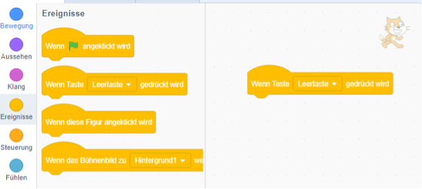

Nun ändern wir noch den Befehl von „Leertaste“ zu „Pfeil-nach-links“, indem wir auf den kleinen weißen Pfeil innerhalb des Blocks klicken.

Im nächsten Schritt bauen wir unsere Aktion, das Drehen der Katze, ein. 
Dazu klicken wir wieder am linken Bildschirmrand auf „Bewegung“, wählen den Block „drehe dich ↺ um 15 Grad“ und ziehen ihn direkt unter unsere „Wenn-Bedingung“ im Arbeitsbereich.

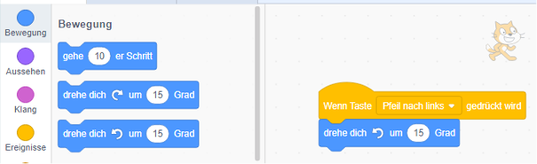

Wenn wir jetzt auf unserer Tastatur die Taste „Pfeil-nach-links“ drücken, dreht sich unsere Katze einmalig um 15 Grad. Wenn wir die Taste aber gedrückt halten, dreht Sie sich so lange im Kreis, bis wir die Taste wieder loslassen.

Damit haben wir unser erstes Teilziel auch schon erreicht! 

Da sich unsere Katze aber auch nach rechts drehen soll, benötigen wir diese Blöcke nochmals für die Bedingung „Pfeil-nach-rechts“. 
Dazu können wir einfach auf unsere bestehenden Blöcke mit der rechten Maustaste klicken und den Punkt „duplizieren“ auswählen. Auf diese Weise haben wir den gesamten Ablauf kopiert.

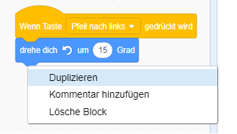

Jetzt bearbeiten wir noch den zweiten Block, indem wir statt „Pfeil-nach-links“ die Option „Pfeil-nach-rechts“ auswählen. Den Block „drehe dich ↺ um 15 Grad“ können wir mit einem Rechtsklick auf unserer Maus durch die Auswahl von „Lösche Block“ einfach entfernen.

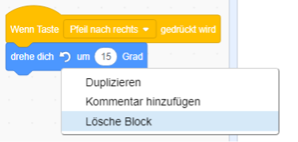

Anschließend ersetzen wir den gelöschten Block noch mit „drehe dich ↻ um 15 Grad“. Dazu ziehen wir den Block wieder aus dem Punkt „Bewegung“ in unseren Arbeitsbereich.

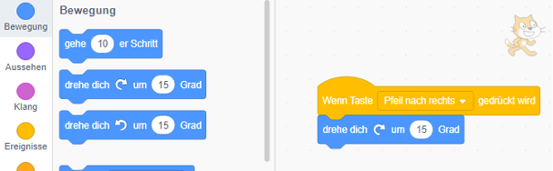

Durch Drücken der Taste „Pfeil-nach-rechts“ auf unserer Tastatur testen wir unser Programm. Nun haben wir unser zweites Teilziel erreicht. 😊 

## Erweiterung mit Schleifen / Loops & Abbruchbedingungen

Jetzt möchten wir das Programm weiter verbessern. Die neue Anforderung ist, dass unsere Katze sich auf Tastendruck so lange im Kreis dreht, bis wir erneut eine Taste drücken. Dazu behalten wir unseren bisherigen Ablauf bei und erweitern ihn um einige einfache Bausteine.

Wir können unser neues Teilziel also auch mit dem folgenden Satz zusammenfassen:

„Wenn die Taste „Pfeil-nach-links“ gedrückt wird, wiederhole das Drehen der Katze bis die Stopp-Taste gedrückt wird.“

Die Schlüsselwörter hierbei sind „wiederhole“ und „bis“ – in der Programmierung nennt man dies auch einen „Do-While-Schleife“ oder einen „While-Loop-Block“. 

Wir wählen nun am linken Bildschirmrand unter „Steuerung“ den Block „wiederhole bis …“ und ziehen ihn in unserem Arbeitsbereich direkt auf einen der beiden vorhandenen Abläufe.

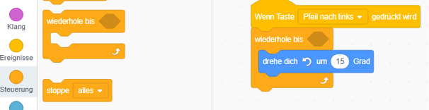

Wenn wir jetzt die Pfeiltaste auf unserer Tastatur drücken, dreht sich unsere Katze zwar sofort im Kreis – hört aber nicht mehr damit auf. Daher müssen wir das leere Feld am Ende des Blocks „wiederhole bis …“ noch mit der sogenannten „Abbruchbedingung“, also unserer Stopp-Taste,
füllen.

Hierbei hilft uns der Block „Taste „Leertaste“ gedrückt?“ aus dem Bereich „Fühlen“. 
Wir ziehen den Block aus dem Bereich am linken Bildschirmrand wieder direkt in einen unserer beiden Abläufe und platzieren ihn auf dem leeren Bereich des Blocks „wiederhole bis …“.

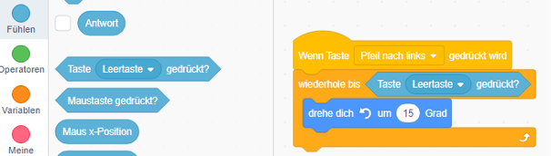

Wenn wir jetzt auf unserer Tastatur die Taste „Pfeil-nach-links“ betätigen, dreht sich unsere Katze so lange im Kreis („do while“), bis wir die Leertaste drücken und damit die Abbruchbedingung erfüllen. Wir haben somit die neue Anforderung erfüllt.
Dies setzen wir nun auch wieder für die Drehung der Katze nach rechts um, d.h. wir kopieren die „Wiederhole-bis“ Schleife und fügen Sie unterhalb der Bedingung „Wenn Taste „Pfeil nach rechts“ gedrückt wird ein“. Anschließend testen wir unser Programm.

## Zurücksetzen mittels Custom Blocks (eigene Blöcke)

Bevor wir mit Custom Blocks, d. h eigenen Blöcken, starten, möchten wir kurz darauf eingehen was diese eigentlich sind und warum sie eine große Hilfe sein können. Innerhalb eines Custom Blocks können wir mehrere Befehle miteinander verbinden und sie ausführen – in etwa so, wie wir es gerade eben schon gemacht haben. Allerdings wird der fertige Ablauf dann in einem einfachen Block zusammengefasst und kann beliebig oft benutzt werden! Dies ist also besonders hilfreich, wenn man immer wieder dieselben Befehle/Blöcke aneinanderreihen und wiederverwenden muss. Es spart Zeit bei der Entwicklung und hilft das Programm zu strukturieren.

Für unser Beispiel bauen wir uns einen etwas kleineren Custom Block, um den Ablauf (also das Drehen der Katze) zu beenden und die Katze in Ihre ursprüngliche Position zurückzusetzen. 

Zuerst benötigen wir einen neuen Custom Block. Dazu klicken wir am linken Rand unter „Meine Blöcke“ auf das Feld „Neuer Block“.

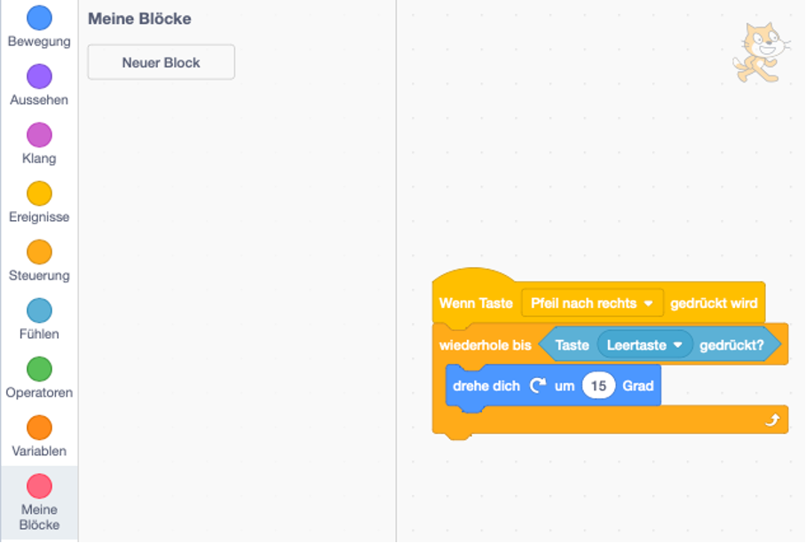

Daraufhin öffnet sich ein neues Fenster, in dem wir unserem Custom Block einen Namen geben und bei Bedarf auswählen können, ob er ein Eingabefeld benötigt. Da wir kein Eingabefeld brauchen, geben wir unserem Block nur einen Namen und bestätigen die Eingabe mit der „OK“-Taste unten rechts. 

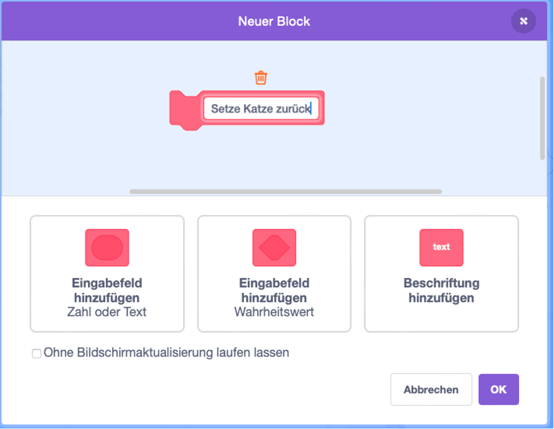

Nachdem wir die Eingabe bestätigt haben, erscheint unser neuer Block sowohl links in der Blockauswahl als auch in unserem Arbeitsbereich. Wir kümmern uns erst einmal um den Block im Arbeitsbereich.

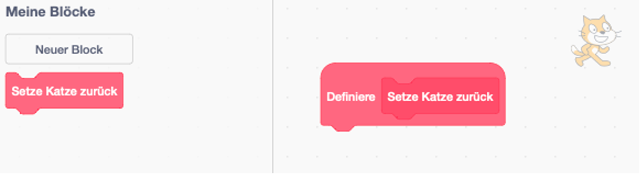

Hier können wir jetzt alle bereits vorhandenen Blöcke an unseren neuen anhängen. Da es unser Ziel ist, die Katze zurückzusetzen, benötigen wir zunächst den Block „gehe zu x: 0 y: 0“ aus dem Bereich „Bewegung“. Dieser sorgt dafür, dass unsere Katze wieder in der Mitte des Bildschirms platziert wird. Wir nehmen den Block also wieder aus der linken Leiste und ziehen ihn mit der Maus direkt unter unseren neuen, eigenen Block:

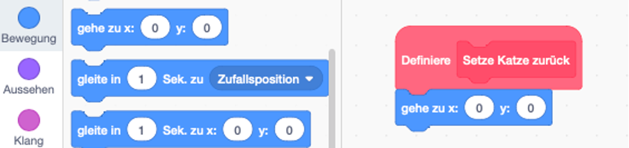

Damit unsere Katze jetzt noch in die gewünschte Richtung schaut, benötigen wir noch den Block „setze Richtung auf 90 Grad“. Diesen Block finden wir ebenfalls im Bereich „Bewegung“. Wir ziehen ihn direkt zu unserem Custom Block.

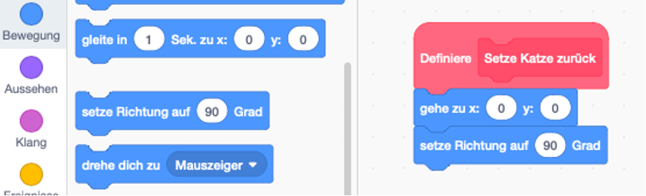

Unser erster Custom Block ist somit bereits fertig! Jetzt müssen wir ihn nur noch verwenden. Hierzu nehmen wir erneut den Block „Wenn Taste „Leertaste“ gedrückt wird“ aus dem Bereich „Ereignisse“ und ziehen ihn in unseren Programmablauf. Da wir die Leertaste als Abbruchbedingung für die Drehung verwenden, ändern wir in diesem Befehl die Taste auf „z“. 

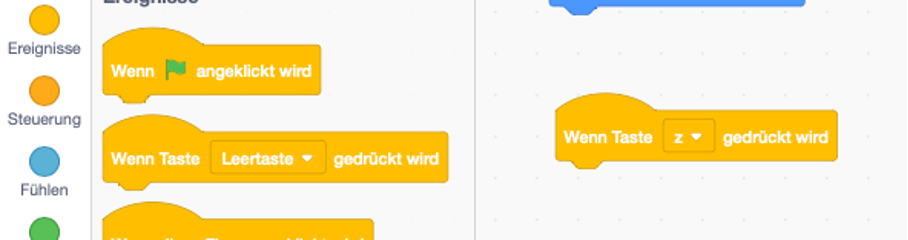

Nun brauchen wir nur noch den „Shortcut“ zum Ablauf unseres Custom Blocks. Dazu nehmen wir den von uns erstellten Block aus dem linken Bildschirmrand unter „Meine Blöcke“ und ziehen ihn direkt unter den neuen „Wenn Taste „z“ gedrückt wird“-Block. 

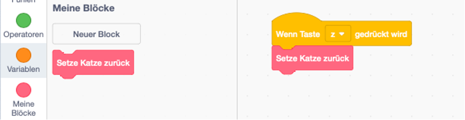

Bevor wir den neuen Ablauf testen, gehen wir ihn nochmals Schritt für Schritt durch. Wenn wir nun die Taste „z“ drücken, startet unser Custom Block. Dieser setzt die Katze auf die Ausgangsposition zurück (x: 0, y: 0) und legt ihre Richtung auf 90 Grad. Der Block „setze Katze zurück“ ist also eine Art Abkürzung zu unserem Custom Block, in dem wir das Zurücksetzen definiert haben. 

Nun probieren wir es aus! Zuerst drücken wir eine der Pfeiltasten, damit die Katze sich dreht. Dann unterbrechen wir die Drehung mit der Leertaste und setzen zum Abschluss die Katze mit der „z“-Taste auf unserer Tastatur zurück. 

Möchten wir unser Programm dahingehend erweitern, dass auch bei Betätigung der „y“-Taste die Katze in die ursprüngliche Position zurückversetzt wird, dann können wir wieder den soeben erstellten „Costum Block“ verwenden. Somit sparen wir Zeit bei der Entwicklung. Wir kopieren die Befehle „Wenn Taste „z“ gedrückt wird“ und „Setze Katze zurück“ und ändern den Buchstaben „z“ in „y“ um. 

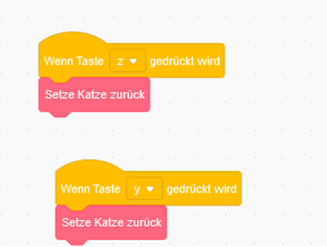

Nun testen wir unser Programm. Wir drücken zuerst die Pfeiltaste nach rechts. Anschließend dreht sich unsere Katze. Mit einer Betätigung der Leertaste stoppt die Drehung der Katze. Anschließend drücken wir die „y“-Taste und die Katze wird auf die Ausgangsposition zurückgesetzt. 

In diesem Kapitel haben wir das bisher Gelernte nochmals vertieft. Zudem haben wir gelernt wie „Costum Blocks“ verwendet werden können. 

# Verwendung von Hintergründen und weiteren Figuren in Scratch

## Vorbereitung & Einfügen der Hintergründe

In diesem Kapitel wollen wir es schaffen, dass die Katze sich mit unserer Tastatur über den Bildschirm bewegen lässt und dabei verschiedene Hintergründe durchläuft. Auch wollen wir eine zweite Figur hinzufügen. 

Wir starten mit einer neuen bzw. leeren Arbeitsumgebung bei Scratch.

Anschließend klicken wir am rechten Bildschirmrand auf das Feld "Bühne". Nun sollte das Feld lila markiert sein.

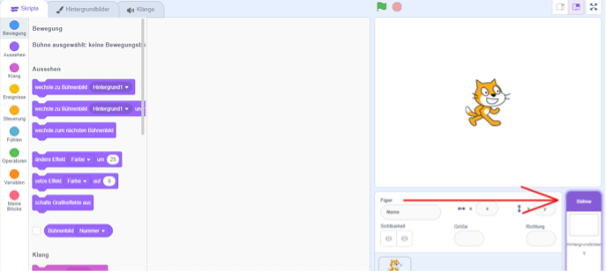

Im nächsten Schritt klicken wir am oberhalb des Arbeitsbereiches auf den Reiter "Hintergrundbilder" und dann auf das Symbol ganz unten links:

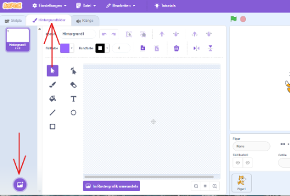

Nun sehen wir eine große Auswahl an verschiedenen Hintergrundbildern und suchen ein beliebiges Hintergrundbild aus. Durch einfaches Klicken auf das Bild wird es direkt in unser Scratch-Projekt übernommen. In unserem vorliegenden Beispiel verwenden wir zunächst den Hintergrund „Blue Sky“.

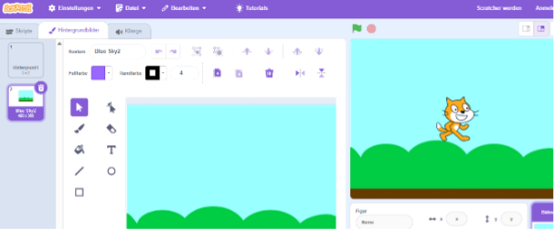

Diesen Vorgang wiederholen wir nun einige Male. Wir können uns kreativ austoben und so viele Hintergrundbilder auswählen, wie wir möchten. In unserem vorliegenden Beispiel werden fünf verschiedene Hintergrundbilder verwendet.

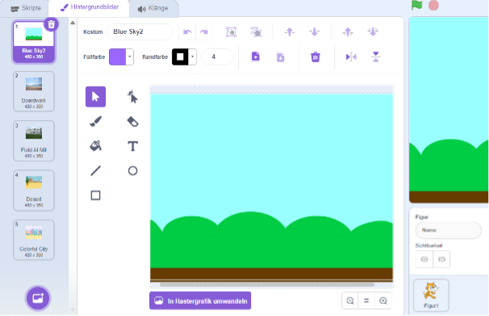

Wenn wir mit unserer Auswahl zufrieden sind, wechseln wir zurück in den Programmierbereich, indem wir auf der unteren rechten Hälfte auf die Katze (Figur 1) und anschließend oben rechts auf den Reiter "Skripte" klicken.

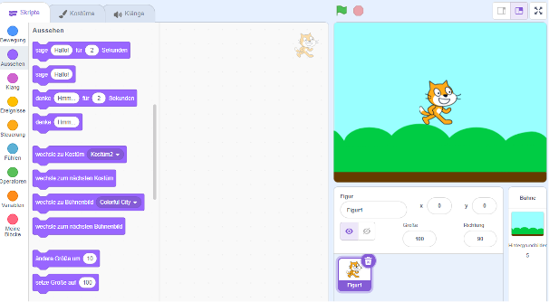

## Anpassen der Position

Nun schwebt unsere Katze noch etwas weit oben. Um dies zu beheben, können wir einfach unterhalb des Bildes die y-Position unserer Katze bearbeiten. In unserem vorliegenden Beispiel verwenden wir den Wert -110. Durch Probieren können wir den Wert so lange anpassen, bis wir zufrieden sind.

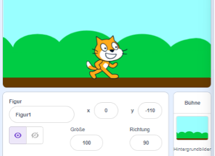

## Katze mit der Tastatur bewegen
Damit unsere Katze sich über den Bildschirm bewegen kann, benötigen wir wieder einige Blöcke, um daraus Funktionen zu bauen. 

Fangen wir mit der Bewegung nach rechts an. Unser Ziel ist es, dass die Katze sich so lange nach rechts bewegt, bis wir die "Pfeil-nach-rechts"-Taste auf unserer Tastatur loslassen.

Dazu ziehen wir den Block "Wenn Taste Leertaste gedrückt wird" aus dem Bereich "Ereignisse" in unseren Programmierbereich.

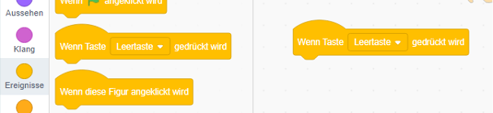

Anschließend klicken wir mit der linken Maustaste auf den Pfeil bei "Leertaste" und wählen "Pfeil nach rechts" durch erneutes Anklicken mit der linken Maustaste aus. 

Nun haben wir bereits die "wenn/if"-Bedingung. Um darauf eine funktionierende Funktion zu bauen, fehlt noch das "dann/then" then – also eine Funktion, welche ausgeführt werden soll. Daher nehmen wir aus dem Bereich "Bewegung" den Befehl "ändere x um 10" und ziehen ihn unter unseren bereits vorhandenen Befehl.

Jetzt lässt sich unsere Katze mit der Taste "Pfeil-nach-rechts" über den Bildschirm bewegen.
Damit die Katze sich aber nicht nur nach rechts bewegt, benötigen wir denselben Befehl noch einmal für die "Pfeil-nach-links" Taste.

Dazu klicken wir mit der rechten Maustaste auf unsere bereits vorhandene Funktion und wählen mit der linken Maustaste "duplizieren" aus.

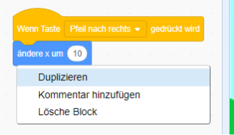

Auf diese Weise haben wir den gesamten Ablauf kopiert und können einfach die Taste auf "Pfeil nach links" und den Zahlenwert bei „ändere x um“ auf "-10" ändern.

Wir testen erneut unser Programm. Nun können wir unsere Katze mit der Tastatur von rechts nach links und von links nach rechts über den Bildschirm bewegen.

## Wechseln der Hintergründe

Damit die Katze sich auch über den "Bildschirmrand" hinaus zum nächsten Hintergrundbild bewegen kann, benötigen wir noch einige weitere Blöcke.

Unser Ziel ist es, dass sich das Hintergrundbild verändert, wenn die Katze den Bildschirmrand erreicht. Dies kann mit einem sogenannten „if-then“ Befehl umgesetzt werden.
In Scratch finden wir diesen unter dem Namen "falls …, dann" im Bereich "Steuerung". 

Wir ziehen den "falls …, dann"-Block vom linken Bildschirmrand direkt unter einen der vorhandenen Befehle in unserem Programmierbereich. 

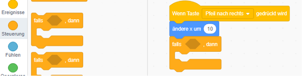

In dem grauen Bereich des Befehls fehlt noch die Bedingung (das, was geprüft werden soll, bevor die Aktion ausgeführt wird). In unserem Fall soll getestet werden, ob die Katze den rechten Bildschirmrand erreicht hat. 

Wenn wir unsere Katze nun mit den Pfeiltasten an den rechten Bildschirmrand bewegen, fällt uns auf, dass sich der "x-Wert" unter dem Bild erhöht. In dem vorliegenden Beispiel endet der Wert bei 272, dies kann generell jedoch leicht variieren.

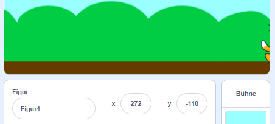

Wir bewegen also unsere Katze an den äußeren rechten Rand und notieren uns den "x-Wert". Der notierte Wert kann optimal als Bedingung genutzt werden. Dazu verwenden wir aus dem Bereich "Operatoren" den Block "… > 50" und ziehen ihn direkt in das leere Bedingungsfeld. Den Wert 50 ändern wir ab. Dazu verwenden wir einen minimal kleineren Wert als den notierten. In unserem vorliegenden Beispiel wählen wir demnach den Wert 270 statt 272, da geprüft werden soll, ob dieser Wert überschritten wird. 

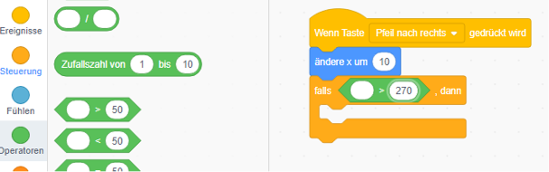

Jetzt fehlt noch die linke Hälfte der Bedingung, also das, was größer als 270 sein soll.
Da wir bereits wissen, dass die x-Position der Katze größer als 270 sein soll, können wir diesen Wert genauso verwenden. 

Dazu nehmen wir aus dem Bereich "Bewegung" den Block "x-Position" und ziehen diesen in das weiße Bedingungsfeld unseres Ablaufs. 

**Wichtig:** Wir benötigen den Block "x-Position" und nicht den Block "Maus x-Position".

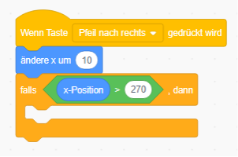

Somit haben wir unsere erste "if bzw. falls" Abfrage mit einer Variablen (der x-Position) fertiggestellt. Jetzt fehlt nur noch das "then bzw. dann", also das, was danach geschehen soll.

Da wir den Hintergrund wechseln wollen, klicken wir auf den Bereich "Aussehen". Hier ziehen wir den Block "wechsle zum nächsten Bühnenbild" in die Mitte des "falls…, dann"-Blocks.

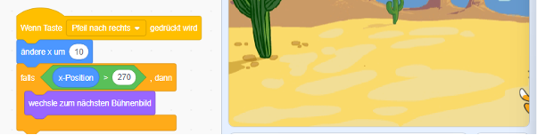

Wenn wir jetzt die Pfeiltaste-nach-rechts auf unserer Tastatur drücken, wechselt unser Hintergrundbild.

Dabei fällt jedoch auf, dass die Katze am rechten Rand stehen bleibt und nicht mehr über das ganze Bild läuft. Wir wollen aber, dass unsere Katze wieder von ganz links startet, sobald das Hintergrundbild wechselt.

Um diesen Fehler zu beheben, können wir direkt innerhalb unseres "falls…, dann"-Blocks einen weiteren Befehl bzw. Block einbauen. Dazu wählen wir im Bereich "Bewegung" den Block "setze x auf 272" und ziehen ihn direkt unter den Befehl "wechsle zum nächsten Hintergrundbild". 

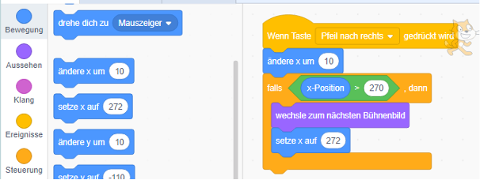

Im nächsten Schritt ändern wir den Wert von 272 auf -270 und starten erneut den Test unseres Programms. Wie wir sehen, läuft unsere Katze nun von links nach rechts über alle unsere Hintergründe, die wir zu Beginn dieser Challenge ausgewählt haben.

Damit unsere Katze auch nach links (also zurück zum letzten Hintergrund) gehen kann, bauen wir den gesamten Ablauf nochmals für unseren "wenn Taste Pfeil nach links"-Block.

Dabei müssen wir beachten, dass sowohl die Werte als auch die Abfrage angepasst werden müssen (statt "x > 270": "x < -270). Nun können wir es in Ruhe ausprobieren. Die Lösung ist in der folgenden Abbildung zu finden.

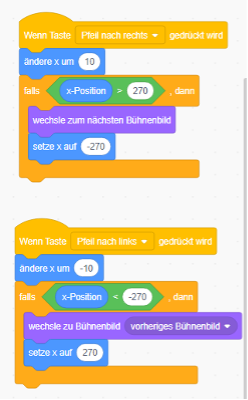

## Erweiterung um eine zweite Figur

In Scratch gibt es neben der Katze noch viele weitere Figuren, die eingesetzt werden können.
Es ist auch möglich, mehrere Figuren in einem Programm zu integrieren. 

Die Einbindung weiterer Figuren soll im Folgenden näher beleuchtet werden. 

Zuerst klicken wir im Bereich "Figur" unten rechts auf das Symbol mit der Katze:

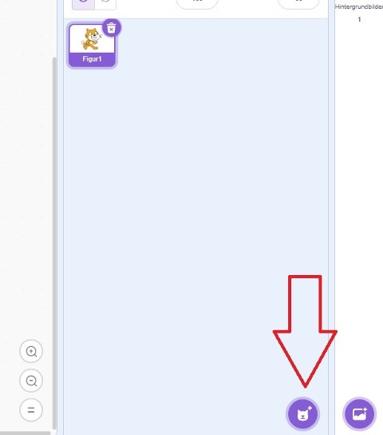

Hier sehen wir viele verschiedene Figuren, Gegenstände, etc. 
In unserem vorliegenden Beispiel wählen wir die Figur "Chick", indem wir sie mit der linken Maustaste anklicken.

Neben unserer Katze erscheint daraufhin die neue Figur "Chick" auf dem Bildschirm. Zusätzlich wird sie als weitere Figur neben unserer Katze im Bereich "Figur" angezeigt. Wir wählen die neue Figur mit der linken Maustaste an. 

Wie wir jetzt merken, ist unser Programmierbereich plötzlich leer. Aber keine Sorge, unsere bisherige Arbeit ist nicht verschwunden! 

Der Programmierbereich erscheint leer, weil jede Figur einen eigenen Bereich erhält und somit völlig eigenständig Programmabläufe ausführen kann. Wir können also durch einen Klick auf unsere Katze zurück zu unserem "alten" Programmierbereich gelangen. Dort ist unsere bisherige Arbeit nach wie vor verfügbar.

## Anpassen der Figur

Wir bleiben vorerst bei unserer neuen Figur und nehmen zunächst einige kleine Änderungen vor. In unserem vorliegenden Beispiel ändern wir die Größe von 100 auf 50. Es kann auch jeder andere beliebige Wert gewählt werden.

Anschließend ziehen wir die Figur in den oberen linken Bereich des Bildschirms. Dazu klicken wir die Figur mit der linken Maustaste an, halten die Maustaste gedrückt und bewegen die Figur mit der Maus an die gewünschte Position. Alternativ können die x- und y-Werte über das Eingabefeld definiert werden.

## Eigenen Programmablauf für die neue Figur definieren

Genau wie bei unserer Katze können bei unserer neuen Figur sehr viele Programmabläufe realisiert werden. Der Kreativität sind keine Grenzen gesetzt!

In unserem vorliegenden Beispiel lassen wir den Vogel einen Ton ausgeben, wenn wir mit unserer Katze einen bestimmten Hintergrund betreten. 

Dazu nehmen wir den Befehl "Wenn das Bühnenbild zu Hintergrund1 wechselt" aus dem Bereich "Ereignisse" und ziehen es in den noch leeren Programmierbereich unserer neuen Figur.

Anschließend wählen wir statt "Hintergrund1" einen passenden Hintergrund aus der Liste, indem wir auf den Pfeil neben "Hintergrund1" klicken. In unserem vorliegenden Beispiel wählen wir den Hintergrund "Canyon". Es kann alternativ ein anderer beliebiger Hintergrund gewählt werden.

Nun haben wir bereits die "wenn/if" Bedingung. Um darauf eine funktionierende Funktion zu bauen, fehlt noch das "dann/then – also eine Funktion, welche ausgeführt werden soll. 

Dazu wählen wir aus dem Bereich "Klang" den Block "spiele Klang… Chirp" und ziehen ihn mit der Maus direkt unter die „Wenn…“-Bedingung in unserem Programmierbereich:

Nun testen wir unser Programm. Dazu lassen wir unsere Katze mit den Pfeiltasten so lange über den Bildschirm laufen, bis wir beim gewählten Hintergrund ankommen. Sobald wir den Hintergrund betreten, sollte ein Pfeifen zu hören sein. Ist dies der Fall, haben wir erfolgreich eine zweite Figur und einen zweiten Programmablauf integriert.

