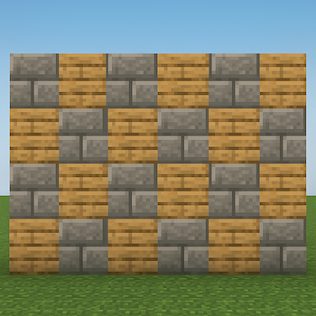

# Blocks

## Vorbereitung
1. Klicken Sie auf den folgenden [Link](https://classroom.github.com/a/s4VcW-Rs)
2. Wählen Sie Ihren Namen aus der Liste (falls diese Liste angezeigt wird)
3. Klicken Sie in der geöffneten Webseite auf **“Accept this assignment”**
4. Klicken Sie in der aktualisierten Webseite auf den Link unter **“Your assignment repository has been created:”**
5. **Warten Sie ca. 30 Sekunden, bevor Sie weitermachen!**
6. Klicken Sie auf den Button **“<> Code”**, dann auf **“Codespaces”** und abschließend auf **“Create codespace on main”** – Es öffnet sich ein neuer Tab und ein Codespace wird für Sie eingerichtet.
7. **GANZ WICHTIG:** Lassen Sie sich Zeit bevor Sie weitermachen: Die erste Einrichtung eines neuen Codespaces kann mehrere Minuten dauern. Denken Sie an einen Stein, den Sie ins Wasser geworfen haben, und warten Sie, bis das Wasser wieder völlig ruhig ist.

## Specs

In **Minecraft** benötigen Sie für eine sichere Nacht einen soliden **Block** – genauer: einen **quadratischen Block** aus Bausteinen.  
Ihre Aufgabe ist es, diesen **Quadrat-Block** in Python nachzubauen, wobei jedes Element aus einem ```#```-Zeichen besteht (stellen Sie sich jedes ```#``` als einen Minecraft-Block vor).



Sie schreiben das Programm `blocks.py` (Dateiname bleibt für die automatisierten Tests so bestehen).  
Das Programm soll die Nutzer:innen nach der **Größe** des Quadrats fragen (eine Ganzzahl zwischen **1** und **8** inklusive).

Beispiel für ein Quadrat der Größe `4`:


Wenn die Nutzer:innen `4` eingeben:

~~~shell
$ python blocks.py
Size: 4
####
####
####
####
~~~

Bei einer Eingabe von `2`:
~~~shell
$ python blocks.py
Size: 2
##
##
~~~~

Bei einer Eingabe von `1`:
~~~shell
$ python blocks.py
Size: 1
#
~~~~

Falls keine gültige Zahl zwischen `1` und `8` eingegeben wird, soll das Programm die Nutzer:innen so lange weiter zur Eingabe auffordern, bis eine korrekte Zahl eingegeben wird:

~~~shell
$ python blocks.py
Size: -1
Size: 0
Size: 42
Size: 9
Size: 8
########
########
########
########
########
########
########
########
~~~~

Hinweis zur Darstellung: In der Konsole sind ```#``` minimal höher als breit – das Quadrat wirkt dadurch optisch leicht hochkant. Das ist hier in Ordnung.

## Demo


## Schritt für Schritt

### Pseudocode


