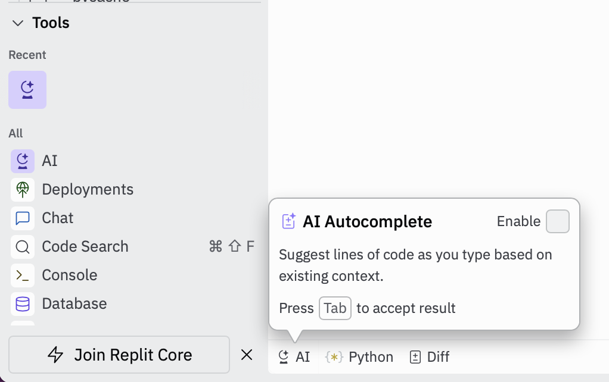

# Replit konfigurieren

Um Code zu schreiben, werden Sie in den folgenden Challenges vorrangig Replit verwenden. Sie benötigen jedoch auch einen GitHub Account, welcher mit Replit verbunden werden muss. GitHub wird von Einzelpersonen oder Teams verwendet, um zusammen an Code zu arbeiten und Änderungen daran zu verfolgen. Hier kann jeder leicht geschriebenen Code mit anderen Personen teilen. Wir verwenden GitHub, um Ihnen den Startercode der Übungsaufgaben zur Verfügung zu stellen und die Abgabe und Korrektur dieser zu verwalten. So erhalten wir leichten Zugriff auf Ihren abgegebenen Code und können sehen, ob er den Anforderungen entspricht.

Führen Sie die folgenden Schritte einmalig durch, um die browserbasierte IDE replit einzurichten:

1. Registrieren Sie sich mit Ihrer studentischen E-Mail-Adresse bei [https://replit.com/](https://replit.com/)
2. Registrieren Sie sich Ihrer studentischen E-Mail-Adresse bei [https://github.com/](https://github.com/)
3. Öffnen Sie [https://replit.com/](https://replit.com/), loggen sich ein, falls noch nicht geschehen, und klicken Sie auf den Button  "+ Create Repl"
4. Klicken Sie in dem Fenster (in der oberen Leiste), das jetzt erschienen ist auf "Import from Github" und anschließend auf "From URL"
5. Kopieren Sie den folgenden Link in das Eingabefeld unter "From URL": [https://github.com/OTH-Digital-Skills/replit_project](https://github.com/OTH-Digital-Skills/replit_project)
6. Klicken Sie auf "Import from Github" und warten Sie einen Moment ab, bis replit geladen wurde.
7. Auf der linken Seite erscheint "Configure your repl" - Scrollen Sie dort ganz nach unten und klicken auf den Button "Confirm and Close"
8. Klicken Sie den Button "Run", um ihr Replit zu konfigurieren
9. Um die Labs herunterzuladen, müssen Sie Ihr Repl mit GitHub authentifizieren: Klicken Sie auf den Tab "Console" und tippen dort den Befehl `github`, gefolgt von der Taste Enter ein.
10. Kopieren Sie die Ausgabe des Programms nach dem Doppelpunkt, d.h. ab ```ssh-rsa ...``` bis zum Ende der Zeichenkette durch Markieren, Rechtsklick mit der Maus und Wählen von Kopieren aus dem Kontextmenü (alternativ ```Strg+C``` unter Windows und ```Cmd+C``` unter Mac OS)
11. Klicken Sie auf den Link [https://github.com/settings/keys](https://github.com/settings/keys) und loggen sich ggf. dort ein. Klicken Sie dann auf "New SSH Key"
12. Fügen Sie den zuvor kopierten Text in das Feld "Key" ein und vergeben einen "Title" z.B. replit, Klicken Sie anschließend auf "Add SSH key"
13. Wechseln Sie zu replit geben Sie auf der Console hinter "Enter your name: " ihren echten Namen ein und bestätigen Sie die Eingabe mit Enter
14. Geben Sie auf der Console hinter "Enter your email: " **ihre studentische Mailadresse ein, mit der Sie sich bei GitHub registriert haben**. (Tipp: Sie können das @-Zeichen hier kopieren, falls Sie Schwierigkeiten mit der Eingabe auf der Kommandozeile haben)
15. Die Meldung "GitHub Setup completed" erscheint und die Einrichtung von replit ist abgeschlossen

Replit sollte sich jetzt selbständig konfigurieren und Sie können starten.

Replit ist eine webbasierte IDE, mit der Sie Code schreiben, ausführen und debuggen können.

Replit ist in die folgenden drei Bereiche unterteilt:

1. **Files** (auf der linken Seite) - Zeigt Ordner und Dateien an. Klickt man auf eine Datei wird diese im **Texteditor** geöffnet.
2. **Texteditor** (mittig) - Hier schreiben Sie Ihren Code
3. **Console** (auf der rechten Seite) - Hier geben Sie die Befehle zum Ausführen Ihrer Programme und zum wechseln von Ordnern ein.

Tippen Sie in der Console den folgenden Befehl ein, gefolgt von Enter, um einen neuen Ordner zu erstellen:

~~~shell
mkdir hello_world
~~~

Vergessen Sie nicht das Leerzeichen zwischen ```mkdir``` und ```hello_world```. Auf diese Art und Weise (d.h. eine Zeile, gefolgt von der Taste Enter) geben Sie alle Befehle in die Console ein. Alle Befehle sind "case-sensitive", d.h. die Groß- und Kleinschreibung muss genau so sein wie in den Beispielen angegeben.

Geben Sie jetzt den folgenden Befehl ein (wieder gefolgt von Enter), um in den neu erstellten Ordner zu wechseln:

~~~shell
cd hello_world
~~~

Die Console sollte in etwas so aussehen und somit anzeigen, dass Sie den Ordner erfolgreich gewechselt haben:

~~~shell
OTH-Console:~/.../hello_world> 
~~~

Erstellen Sie mit dem folgenden Befehl Ihr erstes Programm:

~~~python
touch hello_world.py	
~~~

Im Bereich Files (auf der linken Seite) können Sie jetzt sehen, dass eine neue leere Datei erstellt wird. Klicken Sie auf diese Datei, um diese im Texteditor zu öffnen.

Tippen Sie auf der Console den folgenden Befehl ein, um sich alle Dateien im Ordner ```hello_world``` anzeigen zu lassen:

~~~shell
ls
~~~

Die Ausgabe sollte wie folgt sein (die Datei ```hello_world.py``` haben Sie zuvor mit ```touch hello_world.py``` angelegt):

~~~shell
ls
hello_world.py
OTH-Console:~/.../hello_world> 
~~~

Erstellen Sie jetzt Ihr erstes Programm: Tippen Sie dazu den folgenden Code in den Texteditor, exakt so, wie hier dargestellt:

~~~python
def main():
  print("hello world!")

main()
~~~

Tippen Sie den folgenden Befehl in der Console, um zu Testen, ob alles wie erwartet funktioniert:

~~~shell
python hello_world.py 
~~~

Ihr Programm sollte die folgende Ausgabe erzeugen:

~~~shell
hello world!
~~~

Glückwunsch! Sie haben replit erfolgreich eingerichtet und ihr erstes Python-Programm geschrieben!

Standardmäßig ist in Replit die Funktion "AI Autocomplete" aktiviert. Diese schlägt automatisch Optionen zur Vervollständigung ihres Codes auf Basis von Kommentaren und bestehendem Code vor. Wir empfehlen Ihnen **dringend**, diese Funktion zu deaktivieren, wenn sie wirklich etwas über Programmierung lernen wollen.

Öffnen Sie dazu die Datei ```hello_world.py``` und klicken für am unteren Rand der Umgebung auf "AI". Entfernen Sie hier den Haken neben "Enable", wie auf dem Screenshot zu sehen.


