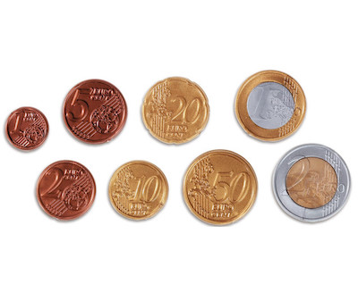

# Cash

Diese Aufgabe ist optional und bietet Ihnen noch mehr Übungsmöglichkeiten.

## Vorbereitung

In ELO finden Sie bei der dazugehörigen Aufgabe einen Link. Klicken Sie auf diesen, um mit der Bearbeitung der Aufgabe zu beginnen. Kehren Sie nach dem Öffnen der Seite zu dieser Anleitung zurück.

Link zu ELO/Moodle: [https://elearning.oth-regensburg.de](https://elearning.oth-regensburg.de)

Laden Sie sich den Startercode für die Aufgabe mit dem ```get EXERCISE_NAME``` Befehl in replit herunter. Begeben Sie sich danach, in der OTH-Console, mit dem vorher erklärten Befehl ```cd``` in den neuen Ordner der Cash-Aufgabe.

## Specs

Wenn Sie Wechselgeld an einen Käufer ausgeben, versuchen Sie so wenige Münzen wie möglich zurückzugeben, damit Ihnen die Münzen nicht ausgehen, und um die Kunden nicht zu verärgern. Praktischerweise gibt es in der Informatik einen Ansatz, um dieses Problem zu lösen.

### Greedy-Algorithmus

Laut Wikipedia ([https://de.wikipedia.org/wiki/Greedy-Algorithmus](https://de.wikipedia.org/wiki/Greedy-Algorithmus)) "zeichnen sich [Greedy-Algorithmen] dadurch aus, dass sie schrittweise den Folgezustand auswählen, der zum Zeitpunkt der Wahl den größten Gewinn bzw. das beste Ergebnis [...] verspricht". 



Was bedeutet das für das oben geschilderte Problem? Angenommen eine Kassiererin möchte Kunden Wechselgeld geben und in der Schublade der Kassiererin befinden sich alle Euro Münzen: € 2, € 1, 50 Cent, 20 Cent, 10 Cent, 5 Cent, 2 Cent und 1 Cent. Das zu lösende Problem ist, welche Münzen und wie viele von jeder Münze als Wechselgeld ausgehändigt werden muss.

Eine "greedy"-Kassierin will das Problem mit jedem Griff in die Wechselgeldschublade möglichst stark verkleinern. Wenn ein Kunde 76 Cent bekommt, dann wird die Kassiererin erst ein 50 Cent-Stück nehmen, da dies das Problem bei einem Rückgabebetrag von 0 anzukommen maximal verkleinert. Das Problem hat sich dadurch von 76 Cent auf 26 Cent verkleinert, da 76 - 50 = 26. Dieses kleinere Problem kann jetzt auf die selbe Art gelöst werden. Eine 50 Cent Münze kann jetzt offensichtlich nicht mehr zurückgegeben werden, aber 26 - 20 = 6 funktioniert. Es bleiben also 6 Cent übrig, welche in eine 5 Cent Münze und in eine 1 Cent Münze aufgeteilt werden können. Das Problem ist gelöst, wenn auch diese an die Kunden zurückgegeben wurde. Der Kunde erhält demnach insgesamt 4 Münzen (1 x 50 Cent, 1 x 20 Cent, 1 x 5 Cent und 1 x 1 Cent).

Dieser Algorithmus bietet eine optimale Lösung für das Problem und liefert immer die minimale Anzahl von Münzen zurück.

Implentieren Sie Ihr Programm in der Datei ```cash.py```. Dieses Programm fragt die Nutzer zuerst wie viel Wechselgeld sie bekommen und gibt danach die dazu notwendige Anzahl von Münzen aus:

~~~
$ python cash.py 
Cash: 76
Minimale Anzahl Münzen: 4
~~~

* Verwenden Sie ```get_int``` um den Betrag des Wechselgelds von den Nutzern einzulesen. Lesen Sie den Betrag in Cent ein, d.h. ein Wechselgeld von € 4,31 entspricht einer Eingabe von 431.
* Geben Sie das Ergebnis mit ```print``` aus.
* Lagern Sie die Berechnung der zurückzugebenden Münzen in eine Funktion ```get_coins``` aus, welche die Anzahl dieser Münzen als Ergebnis zurückgibt. In den Notes finden Sie Beispiele für solche Funktionen.
* Fordern Sie die Nutzer erneut zu einer Eingabe auf, falls diese eine negative Zahl eingeben.

## Testen

Testen Sie, ob Ihr Code wie erwartet für die folgenden Eingaben funktioniert:

* ```-1``` oder anderen negativen Eingaben
* ```0```?
* ```1``` oder anderen positiven Eingaben
* keine Eingabe, wenn die Nutzer direkt Enter drücken

Wenn alle manuellen Tests erfolgreich waren, können Sie Ihr Programm auch wie folgt automatisch auf der Console testen:


    check EXERCISE_NAME


Tipp: Der ```EXERCISE_NAME``` beginnt mit ```lab-04-cash-``` und endet mit Ihrem GitHub Usernamen. Der Name des aktuellen Ordners, in dem sich die Aufgabe befindet, ist gleichzeitig der ```ÈXERCISE_NAME```. Den Namen des aktuellen Ordners können Sie außerdem direkt vor Ihrem Befehl in der Konsole entnehmen.


Basierend auf CS50 von David J. Malan (Harvard University, 2022).

[Impressum Digital Skills](https://reader.tutors.dev/#/note/zusatzstudium-digital-skills-alle-semester.netlify.app/unit-4/note-1)
