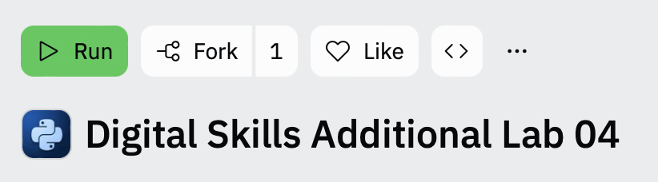
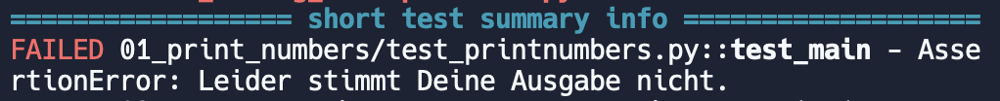

# Mini-Aufgaben

Diese Aufgaben sind optional und bieten Ihnen noch mehr Übungsmöglichkeiten.

## Vorbereitung

Klicken Sie auf den folgenden Link, um die Aufgaben zu beginnen:

[https://replit.com/@xYoshioka/Digital-Skills-Additional-Lab-04?v=1](https://replit.com/@xYoshioka/Digital-Skills-Additional-Lab-04?v=1)

Diese kleinen Übungsaufgaben programmieren Sie in einer anderen Replit-Umgebung als die anderen umfangreicheren Lab-Aufgaben.

Nach Öffnen des Links sehen Sie rechts einen Button "Fork". 

Drücken Sie darauf und anshchließend auf "Fork Repl".  Die Umgebung zur Bearbeitung der Übungsaufagebn öffnet sich.

## Specs

Unter "Files" finden Sie einige kleine Übungsaufgaben, welche nummeriert sind. Wenn Sie beispielsweise auf 01_printnumbers drücken, sehen Sie zwei für Sie wichtige Files: 
- readme.md - Hier finden Sie die Aufgabenstellung, welche Sie bearbeiten sollen.
- printnumbers.py - Hier programmieren Sie die Übungsaufgabe und fügen Ihren Code hinzu.

Jede Übungsaufgabe ist auf diese Art und Weise aufgebaut.

## Testen

Möchten Sie Ihre Aufgaben testen, so können Sie dies einerseits manuell erledigen. Hierfür öffnen Sie die Shell und navigieren zum entsprechenden Ordner, also z.B.:

~~~shell
cd 01_print_numbers
~~~

Mit dem folgenden Befehl können Sie ihr Programm nun z.B. ausführen:

~~~shell
python printnumbers.py
~~~

Funktioniert ihr Programm und Sie möchten Ihre Aufgaben automatisiert testen lassen, so drücken Sie einfach auf den grünen Run-Button oben mittig. Alle Übungsaufgaben werden anschließend in der Console getestet. Am Ende wird Ihnen eine Übersicht darüber gegeben, für welche Aufgaben noch welche Testfälle fehlschlagen. Hier schlägt beispielsweise der Test für Aufgabe 01 noch fehl.

Wird der Test dort nicht mehr aufgeführt, so funktioniert Ihre Lösung. Wenn Sie alle Übungsaufgaben erfolgreich bearbeitet haben, sollten die Testfälle auch alle erfolgreich durchgeführt werden können.

## Abgabe

Diese Aufgaben müssen Sie nicht abgeben. Vergessen Sie jedoch nicht, die anderen Aufgaben dieses Labs wieder in Ihrer anderen eingerichteten Replit-Umgebung zu programmieren.