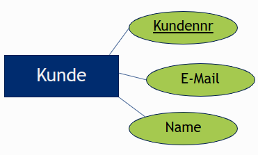
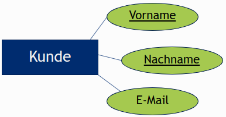
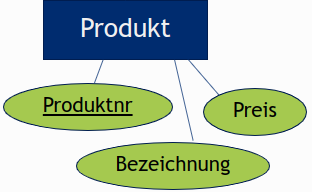
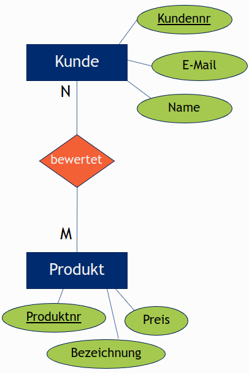
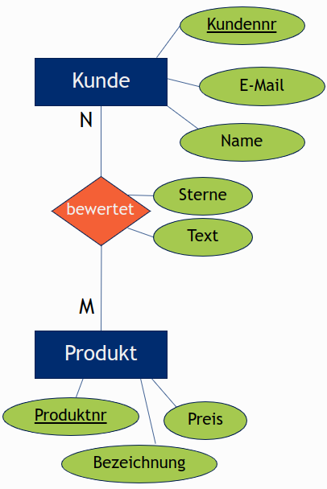
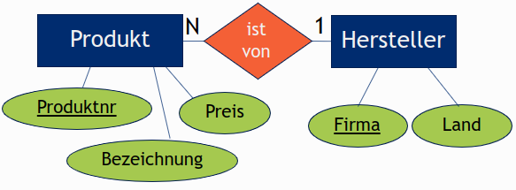
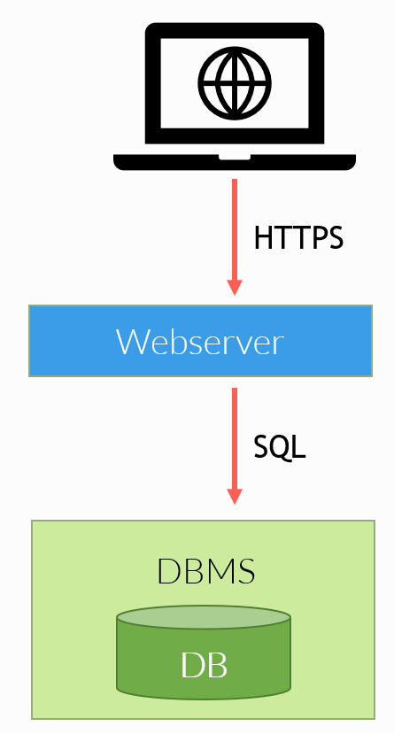

Note Challenge 7

Data Science und SQL

[[toc]]


Diese Challenge beschäftigt sich zum einen mit Anwendungen aus dem Bereich der Data Science und zum anderen mit Datenbanken und der dazugehörigen Anfragesprache SQL.

# #1 Data Science

Wir werden uns nun Anwendungen aus dem Bereich Data Science anschauen. Diese verfolgen die Aufgabe, aus Daten Wissen zu extrahieren. Was wir hier machen, ist nur der aller simpelste Fall: Die Daten liegen in strukturierter Form vor (so ähnlich wie in einer Excel-Tabelle mit Zeilen und Spalten) und wir berechnen aus den einzelnen Datenwerten ein Ergebnis. In der Realität können die zu analysierenden Daten aber auch unstrukturiert sein, also z. B. Texte oder Bilder. Data Science kann dann dabei helfen, Informationen aus diesen Daten zu extrahieren, beispielsweise, worum es in dem Text geht oder wer oder was auf dem Bild zu sehen ist.


## CSV: Comma-Separated Values

Die folgenden Zeilen zeigen den Inhalt einer Datei robot_log.csv. In diese Datei hat ein Roboter reingeschrieben, wann er wie weit gefahren ist.

```jsx
timestamp,distance
2022-05-01 15:38:12.155,58
2022-05-01 15:40:48.483,144
2022-05-01 16:29:21:766,92
```

Finden Sie die Kommas? Comma-separated Values bedeutet Komma-getrennte Werte. Jede Zeile ist ein Datensatz und in unserer Datei besteht jeder Datensatz aus genau zwei Werten: Ein Zeitstempel und eine Zahl. Um kurz nach halb vier am 1. Mai ist der Roboter 58cm gefahren.

CSV-Dateien werden auch oft als Datenaustauschformat verwendet. Der Betreiber eines Online-Shops kann sich zum Beispiel eine CSV-Datei mit allen Kundendaten herunterladen. Dann steht in jeder Zeile: `Kundennummer,Vorname,Nachname`, usw. Und diese Datei kann man dann analysieren, in ein anderes Programm laden oder in eine Datenbank importieren. Datenbanken schauen wir uns später an.


## Data Science mit Python

Ich hätte gerne ein Programm, was folgendes macht:

1. Daten aus der CSV-Datei lesen
2. Die Summe über alle vom Roboter gefahrene Strecken (in cm) berechnen und ausgeben

Um dies zu tun, gibt es viele Möglichkeiten. Man könnte die ganze CSV-Datei in eine String-Variable einlesen. Dann muss man sich aber selbst drum kümmern, die einzelnen Werte, die sich zwischen den Kommas befinden, zu extrahieren. Es gibt aber auch Python-Bibliotheken, die einem diese Arbeit abnehmen. Eine solche Bibliothek nennt sich “csv”, die würde im Prinzip ausreichen. Aber ich möchte dennoch gerne die Bibliothek pandas verwenden. Die kann nämlich aus unserer Datei einen sogenannten Pandas Dataframe erzeugen, auf welchem sich leicht arbeiten lässt! Pandas kommt für Data-Science-Anwendungen sehr oft zum Einsatz. In Replit muss das Paket zunächst installiert werden. Dazu sucht man im Bereich “Packages” nach “pandas3” und klickt auf das kleine Plus-Symbol.

```python
import pandas as pd
df = pd.read_csv('/media/tmpfs/robot_log.csv', sep=',')
```

Zuerst wird das Pandas-Paket importiert und pd genannt. Das heißt, ab nun kann man mit `pd.` auf die Funktionen im Paket zugreifen. Die Funktion, die wir brauchen nennt sich `read_csv`. Hätten wir eine Excel-Datei vorliegen, würden wir `read_excel` verwenden. Als Parameter übergeben wir der Funktion den Pfad zu unserer CSV-Datei, die eingelesen werden soll. Danach lassen sich noch jede Menge Optionen setzen, in unserem Falle setzen wir `sep=’,’`, weil das Spaltentrennzeichen in unserer Datei ein Komma ist. Auch wenn das Format CSV (Comma-separated Values) heißt, werden oft auch Semikolons, senkrechte Striche, Tabs oder andere Zeichen als Spaltentrenner verwendet.

Als Resultat nach dem Einlesen der Datei haben wir nun einen *Pandas Dataframe* vorliegen. Daher nennen wir die Variable auch `df`. Mann kann sich einen Dataframe vorstellen als eine Tabelle, die aus Zeilen und Spaten besteht. In unserem Fall haben wir 3 Zeilen und 2 Spalten. Die Zeilen werden einfach durchnummeriert, also 0, 1 und 2 (wie bei einer Liste) und die Spalten haben jeweils einen eigenen Namen: “timestamp” und “distance”. Die Spaltennamen werden automatisch aus der ersten Zeile der CSV-Datei entnommen, dem sogenannten Header. Besäße unsere CSV-Datei keinen Header, könnte man die Spaltennamen auch manuell setzen mit dem Parameter `names=['timestamp', 'distance']`.

Ähnlich wie bei Listen kommt man nun mittels `len(df)` an die Anzahl der Zeilen im Dataframe. In unserem Fall liefert das den Wert 3.

Über das Attribut `loc` erhalten wir Zugriff auf bestimmte Zeile im Dataframe. Die erste Zeile ist `loc[0]`, die zweite `loc[1]`, usw. Und innerhalb einer Zeile kommen wir dann an die Werte in den einzelnen Spalten. Das folgende Beispiel gibt uns den Wert in der Spalte “distance” in der ersten Zeile aus:

```python
print(df.loc[0,'distance’])
```

Mit diesem Wissen können wir jetzt unsere kleine Aufgabe schon lösen! Wir können eine `for`-Schleife von 0 bis zur Länge des Dataframes `len(df)-1` laufen lassen und in jeder Iteration auf die Spalte “distance” zugreifen:

```python
total_distance = 0
for i in range(len(df)):
    total_distance += df.loc[i,'distance']
print(total_distance)
```

Das liefert uns das Ergebnis von 294 cm (= 58 + 144 + 92). 

Dieser Ansatz mit der Schleife ist in der Praxis aber absolut nicht zu empfehlen! Man soll eigentlich nicht über die eizelnen Elemente in einem Pandas Dataframe iterieren. Das ist ineffizient, macht viel Schreibarbeit und es schleichen sich leicht Fehler dabei ein. Die folgende Codezeile macht genau das gleiche, ist aber deutlich eleganter:

```python
print(df["strecke"].sum())
```

Das liest sich doch auch viel besser: Berechne von der Spalte “strecke” die Summe und gib sie aus!

`df["strecke"]` liefert eine Liste zurück mit allen Werten in der Spalte “strecke”, also so etwas wie ein Vektor. Und darauf lässt sich einfach die Methode `sum()` aufrufen und schon haben wir die Summe aller in der Spalte befindlichen Zahlen.


## Funktionsweise von Data Science

Das war jetzt ein extrem simples Beispiel und man könnte sich streiten, ob man das überhaupt schon Data Science nennen kann. Aber genau so funktionieren auch komplexere Anwendungen: Daten werden von irgendwo geladen - evtl. sogar aus mehreren Quellen - und dann werden Analysen damit gemacht. Oft besteht eine Data-Science-Anwendung aus den folgenden Schritten:

- **Problembeschreibung**: Was soll berechnet werden und warum? Welchen Mehrwert bieten uns später einmal die Ergebnisse?
- **Datenbeschaffung**: Wie kommen wir an die Daten? Welche Daten helfen uns?
- **Data Cleaning**: Die meiste Arbeit verbringen Data-Scientists damit, die Daten zu säubern, das heißt, in ein Format zu bringen, mit dem man gut damit arbeiten kann. In diesem Schritt werden unsinnige und doppelte Datensätze entfernt und Transformationen durchgeführt, z. B. Zahlenwerte von inch in cm umgewandelt.
- **Datenanalyse**: Wie in unserem Fall kann eine Berechnung auf den Daten ausgeführt werden. Es kommt aber häufig auch Machine-Learning zum Einsatz. Darunter sind Methoden der künstlichen Intelligenz gemeint, die zunächst in einem Lernprozess ein statistisches Modell trainieren und mithilfe dieses Modells Vorhersagen oder Entscheidungen treffen können. Denkbar sind in diesem Schritt auch Visualisierungen, also visuelle Darstellungen der Daten oder der Berechnungsergebnisse mit Hilfe von Diagrammen und anderen Grafiken.
- **Optimierung**: Sind wir mit dem Ergebnis zufrieden? Macht das Machine-Learning noch Fehler? Dieser Schritt besteht daraus, zu evaluieren, wie gut unser Modell performt, und Möglichkeiten zu finden, um das Ganze noch weiter zu verbessern.


# #2 Datenbanken

Das Vorgehen, eine Datei mit Python einzulesen und mittels eines Python-Programms zu analysieren, eignet sich für kleine bis mittelgroße Datenmengen und vor allem nur dann, wenn man als einziger auf die Daten zugreift. Spätestens dann, wenn viele Benutzer gleichzeitig auf Daten zugreifen, kommen Datenbanken ins Spiel.

Eine Datenbank speichert Daten, auf die wir über eine Schnittstelle zugreifen können. Wir lernen in dieser Challenge die Datenbanksprache SQL kennen. SQL bietet Kommandos wie INSERT, UPDATE, DELETE und SELECT, um Daten in die Datenbank einzufügen, zu ändern, zu löschen und abzufragen. SQL ist die standardisierte Abfragesprache für alle gängigen relationalen Datenbankmanagementsysteme.

Wenn man sich zum Beispiel einen Webshop anschaut, führt jeder Klick eine oder sogar mehrere Datenbankanfragen aus: Beim Stöbern im Produktkatalog werden Bezeichnungen und Preise von Artikeln aus der Datenbank geladen und wenn ich ein Produkt bewerte, wird ebendiese Bewertung in die Datenbank eingefügt.

## Relationale Datenbanken

In einer relationalen Datenbank werden Daten in Tabellen gespeichert, man nennt sie auch Relationen. Ähnlich zu unserem CSV-Beispiel und den Pandas Dataframes besitzen Tabellen Spalten und Zeilen. Die Spalten legen wir beim Anlegen der Tabelle fest, und dabei bestimmen wir für jede Spalte, welchen Datentypen die Werte in dieser Spalte besitzen sollen, mehr dazu gleich.

kundennummer | name    | email
------------ | ------- | -------
5            | Peter   | peter@example.com
8            | Anna    | anna@example.com

Eine relationale Datenbank (DB) wird verwaltet durch ein sogenanntes relationales Datenbankmanagementsystem (DBMS). Die populärsten DBMSs sind Oracle, MySQL, Microsoft SQL Server, PostgreSQL, IBM DB2 und SQLite. Vom Grundprinzip sind sie alle gleich: Sie bieten uns eine SQL-Schnittstelle zur Datenbank. Das erlaubt es uns, beliebige noch so komplexe Anfragen zu stellen und das DBMS kümmert sich darum, sich einen Plan zu machen, wie genau die Anfrage intern möglichst effizient ausgeführt werden soll. Meistens gibt es nämlich viele Ausführungsalternativen, aber darum müssen wir uns nicht kümmern. Wir als Benutzer beschreiben nur *was* wir haben möchten, das DBMS ermittelt dann, *wie* die Anfrage genau ausgeführt wird. Außerdem kümmert sich das DBMS darum, viele sogenannte Datenbank-Transaktionen gleichzeitig abzuwickeln. Es muss dabei nämlich immer aufpassen, dass sich die Transaktionen gegenseitig nicht stören, wenn viele Benutzer gleichzeitig auf die Daten zugreifen.

Zwar gibt es auch andersartige Datenbanken, sogenannte NoSQL-Datenbanken, aber dennoch sind relationale Datenbanken und die dazugehörige Anfragesprache SQL meist die erste Wahl bei vielerlei Anwendungen. In einem Online-Shop lassen sich in einer Tabelle alle Produkte abspeichern, in einer anderen Tabelle alle Kunden und in einer dritten Tabelle Bewertungen, also welcher Kunde welches Produkt wie gut fand und was sie oder er dazu geschrieben hat. In einem sozialen Netzwerk haben wir eine Tabelle mit Nutzern, eine Tabelle mit Seiten und eine weitere mit Gruppen. Und auch hier muss wieder gespeichert werden, welcher Nutzer welcher Seite folgt oder Mitglied in welcher Gruppe ist. Um solche generelle konzeptionelle Fragen, was alles gespeichert werden soll und wie die einzelnen Dinge miteinander in Beziehung stehen, kümmert man sich in einer Modellierungsphase, für die in relationalen Datenbanken in der Regel ER-Diagramme zum Einsatz kommen.


# #3 ER-Modellierung

ER steht für Entity, Relationship. Eine Entität ist ein “Etwas”, also zum Beispiel der Kunde Peter oder das Produkt Schokoriegel. In einem ER-Diagramm beschreiben wir, welche Entitätstypen es gibt und wie diese in Beziehung zueinander stehen. Beispiel: Es gibt Kunden und Produkte - das sind Entitätstypen - und es gibt die Beziehung “Kunde bewertet Produkt”.


In einem ER-Diagramm sind Entitätstypen als Kästchen dargestellt und Beziehungen als Rauten. Ein weiteres wichtige Konzept in ER-Diagrammen sind Attribute. Sowohl Entitätstypen als auch Beziehungen können Attribute besitzen. Die Attribute eines Entitätstyps beschreiben die Eigenschaften, die jede Entität dieses Typs besitzt. Zum Beispiel hat jeder Kunde / jede Kundin eine Kundennummer, eine E-Mail-Adresse und einen Namen:



Durch das Unterstreichen eines Attributs oder ach mehrerer Attribute kennzeichnen wir den sogenannten Primärschlüssel eines Entitätstyps. Der Primärschlüssel dient zur eindeutigen Identifizierung der einzelnen Entitäten. Dadurch dass in unserem Beispiel die Kundennummer der Primärschlüssel ist, darf es keine zwei Kunden mit der gleichen Kundennummer geben. Die Kundennummer identifiziert einen Kunden nun eindeutig. Es darf aber zwei Kunden geben, die gleich heißen. Wenn zwei Kunden Ute heißen, ist das völlig okay, vorausgesetzt sie haben unterschiedliche Kundennummern. Im folgenden Beispiel sind nun Vorname und Nachname unterstrichen, sie bilden einen sogenannten kombinierten Primärschlüssel:



Nun darf es immer noch zwei Kunden geben, die Ute heißen. Es darf auch zwei Kunden geben, die den Nachnamen Müller haben, aber es darf nur eine Ute Müller geben. Die Kombination aus beiden Attributen muss eindeutig sein. Der Einfachheit halber gehen wir aber wieder zurück zu dem Beispiel mit der Kundennummer. Laufende Nummern sind meistens eine gute Wahl, wenn es um den Primärschlüssel geht. 

Ein Produkt hat eine Produktnummer, eine Bezeichnung und ein Preis. Die Produktnummer ist der Primärschlüssel:



Eine Beziehung kann nun eingesetzt werden, um zu beschreiben, dass Kunden Produkte bewerten können. Auf die Linien zwischen der Beziehung und den dazugehörigen Entitätstypen wird der sogenannte Bezeihungstyp angegeben. Es gibt die Beziehungstypen 1:1, 1:N, N:1 und N:M. Ein Kunde kann viele Produkte bewerten und ein Produkt kann von vielen Kunden bewertet werden. Wir haben hier also eine N:M-Beziehung:



Wie vorhin erwähnt, können nicht nur Entitätstypen, sondern auch Beziehungen Attribute haben. Bei N:M-Beziehungen ist das besonders sinnvoll. In unserem Beispiel von gerade könnten wir einfach nur speichern, dass Peter den Schokoriegel bewertet hat. Mit Hilfe von Beziehungsattributen lässt sich nun noch spezifizieren, wie gut er den Schokoriegel fand und was er dazu für einen Text verfasst hat:



Das folgende ER-Diagramm zeigt, dass Produkte von einem Hersteller sind. Jedes Produkt ist nur von einem einzigen Hersteller, aber von einem Hersteller kann es beliebig viele Produkte geben. Der Schokoriegel ist vom Hersteller Monsterfood. Und die Firma Monsterfood kann neben dem Schokoriegel auch noch viele weitere Produkte herstellen.



Es darf auch Produkte geben, die keinen Hersteller haben. Und es darf Hersteller geben, die gar keine Produkte anbieten. So etwas ist immer möglich und lässt sich in unserem ER-Diagramm nicht verhindern. 1 steht nämlich für 0-oder-1, ein Produkt ist also von keinem oder einem Hersteller. Und N steht für 0-bis-beliebig-viel. Ein Hersteller stellt kein Produkt her, eines, zwei, siebzehn, beliebig viele.


# #4 Datenbankmanagementsysteme

Datenbankmanagementsysteme laufen auf einem sogenannten Datenbank-Server. Dieser kann bei einem Unternehmen im Keller stellen, in einem Rechenzentrum oder in der Cloud. Die Cloud ist im Prinzip auch nur ein Rechenzentrum, bei dem sich Unternehmen Server flexibel mieten können. Wenn bei einem Online-Shop das Weihnachtsgeschät ansteht, können in wenigen Sekunden oder Minuten weitere Server bestellt, automatisch eingerichtet und gestartet werden. Und wenn nach Weihnachten die Auslastung wieder nachlässt, können die zusätzlich angemieteten Ressourcen wieder freigegeben werden. In einem eigenen Rechenzentrum müsste man diese Server erst einmal besitzen, mit Hardware bestücken und anschließen. In der Cloud bezahlt man einfach je nach Nutzung.

Die folgende Abbildung zeigt, wie fast jede Web-Anwendung funktioniert, egal ob Online Shop, Banking-Software, ein soziales Netzwerk oder was auch immer: 



Der Endbenutzer (Client) ruft eine Webseite auf den Webserver ab, meistens indem er oder sie im Browser eine Adresse eingibt. Der Webserver ruft daraufhin aus einer Datenbank alle Daten ab, die auf der Seite angezeigt werden sollen und schickt die Seite zurück an den Client, sodass dieser sie betrachten kann.

Die Datenbankmanagementsysteme Oracle, MySQL, PostgreSQL und so weiter laufen alle als sogenannter Server-Prozess. Ein solcher Prozess läuft einfach durchgehend und wartet auf Anfragen. Kommt eine SQL-Anfrage rein, wird diese bearbeitet und mit einem Ergebnis beantwortet.


## SQLite

Wir verwenden der Einfachheit halber das Datenbankmanagementsystem SQLite. SQLite läuft nicht als Serverprozess. Stattdessen bietet es uns einfach nur eine SQL-Schnittstelle zu einer Datei auf unserer Festplatte. Anders als die CSV-Datei vom Data-Science-Beispiel lässt sicht  diese Datei aber nicht einfach in einem Texteditor öffnen. Will man mit der Datenbank arbeiten, verwendet man SQLite. Und jedes SQL-Kommando, was man dann stellt, wird intern verarbeitet, ausgeführt und liefert uns schließlich ein Ergebnis zurück.

Auf der Linux-Shell (nicht in der Python-Konsole!) können wir eine neue Datenbank anlegen:

```python
> touch webshop.db
> sqlite3 webshop.db
```

Das Linux-Kommando `touch` legt eine neue Datei `webshop.db` an. Anschließend können wir diese mit der SQLite-Shell öffnen. Und in dieser Shell können wir SQL-Kommandos eingeben. Wichtig ist, dass wir in der SQLite-Shell jede SQL-Anfrage am Ende mit einem Semikolon `;` abschließen.

*Tipp: Bisher haben Sie bei Replit in der "Console" gearbeitet. Drücken Sie auf das "+" daneben und tippen Sie "Shell" ein, um ein weiteres Tab zu öffnen. Navigieren Sie in den entsprechenden Ordner des Labs und geben Sie den oben stehenden Befehl "sqlite3 datenbank.db" ein, um anschließend SQL-Kommandos eingeben und ausführen zu können.*


# #5 CREATE TABLE

Mit dem SQL-Kommando `CREATE TABLE` lassen sich neue Tabellen anlegen. Danach können wir darin Daten einfügen, ändern, löschen und abfragen.

```sql
CREATE TABLE kunden(kundennummer INT PRIMARY KEY,
                    name VARCHAR(100),
                    email VARCHAR(500));  
```

Jede Tabelle besitzt einen eindeutigen Namen (hier: `kunden`). In Klammern werden im `CREATE TABLE`-Kommando die Spaltennamen der Tabelle aufgezählt, jeweils mit ihren Datentypen und eventuellen Spaltenoptionen. Als Datentyp für die `kundennummer`-Spalte wurde `INT` gewählt, das sind ganze Zahlen. Die `name`- und `email`-Spalten sind jeweils Strings mit einer maximalen Länge von 100 bzw. 500 Zeichen, in SQL nennt man diesen Typen `VARCHAR`, also eine Zeichenkette variabler Länge. Die `kundennummer`-Spalte bekommt zusätzlich die Spaltenoption `PRIMARY KEY`. Diese Spalte ist also der Primärschlüssel. Eine Kundennummer identifiziert einen Kunden / eine Kundin eindeutig.

Die wichtigsten Datentypen in SQL sind:

- `INT` - Ganze Zahlen, negativ und positiv, z. B. 8, 0, -3, 2319
- `DECIMAL(p,q)` - Kommazahlen mit maximal q Stellen, davon q nach dem Komma, z. B. `DECIMAL(9,2)`: 29.95, -5.00, 1234567.89
- `DOUBLE` - Kommazahlen ohne feste Anzahl von Nachkommastellen. Aufgrund der internen Speicherung können hier Rundungsfehler entstehen.
- `DATE` - Ein Datum, welches aus Jahr, Monat und Tag besteht, z. B. ‘2022-11-30’
- `TIMESTAMP` - Ein Zeitstempel, bestehend aus Datum und Uhrzeit, z. B. ‘2022-11-30 18:30:05.123’
- `CHAR(l)` -  Eine Zeichenkette fester Länge l. Wird ein zu kurzer Wert eingefügt, wird mit Leerzeichen aufgefüllt, z. B. `CHAR(5)`: ‘Hallo’, ‘Hi   ‘
- `VARCHAR(l)` - Eine Zeichenkette mit maximal l Zeichen, z. B. `VARCHAR(5)`: ‘Hallo’, ‘Hi’


## Fremdschlüssel

 Die folgenden beiden `CREATE TABLE`-Statements beschreiben die Struktur der Tabellen `hersteller` und `produkte`:

```sql
CREATE TABLE hersteller (firma VARCHAR(50) PRIMARY KEY,
                         land VARCHAR(100));

CREATE TABLE products (produktnummer INT PRIMARY KEY,
                       beschreibung VARCHAR(100),
                       preis DECIMAL(9,2),
                       hersteller VARCHAR(50) REFERENCES hersteller(firma));
```

Die Spalte `hersteller` in der Tabelle `produkte` ist ein sogenannter Fremdschlüssel. Fremdschlüsselspalten referenzieren andere Spalten, in unserem Fall die Spalte `firma` in der Tabelle `hersteller`. Das bedeutet nun, dass in der Spalte `produkte.hersteller` nur Werte stehen dürfen, die es auch wirklich in der Spalte `hersteller.firma` gibt. Gibt es keinen Hersteller mit Firmennamen Calgonte, darf ich auch bei keinem Produkt den Hersteller Calgonte eintragen.

Folgende Daten könnte man nun in unseren Tabellen speichern:

manufacturers
firma        | land
------------ | -------
Monsterfood  | USA
Holzkopf     | Österreich

produkte
produktnummer | beschreibung    | preis | hersteller
------------- | --------------- | ----- | -----------
17            | Schokoriegel    | 0.89  | Monsterfood
18            | Müsliriegel     | 0.99  | Monsterfood
88            | Katzenfutter    | 4.99  | *NULL*


Es gilt:

- Es gibt Hersteller, die keine Produkte herstellen: Holzkopf taucht nie in der Produkttabelle auf
- Es gibt Produkte ohne Hersteller: Wert `NULL` (`NULL`-Werte sind immer erlaubt, außer in Primärschlüsselspalten oder man vergibt einer Spalte die Option `NOT NULL`)
- Jeder Wert in der `hersteller`-Spalte der Tabelle `produkte`, der nicht `NULL` ist, existiert auch wirklich in der Spalte `firma` der Tabelle `hersteller`. Ein Produkt mit dem Hersteller Calgonte wäre ungültig, weil dieser Wert nicht in der `hersteller`-Tabelle in der Spalte `firma` vorkommt.
- Jeden Firmennamen gibt es in der Tabelle `hersteller` nur einmal (Primärschlüssel)
- Jede Produktnummer gibt es in der Tabelle `produkte` nur einmal (Primärschlüssel)


# #6 INSERT

Mit dem `INSERT`-Kommando lässt sich eine neue Zeile in eine Tabelle einfügen:

```sql
INSERT INTO hersteller (firma, land) VALUES ('Calgonte', 'Italien');
```

Links vom Stichwort `VALUES` stehen in Klammern die Spaltennamen, rechts davon ebenfalls in Klammern die entsprechenden einzufügenden Werte. Wichtig ist, dass String-Werte immer in einfachen Anführungszeichen stehen müssen! Würde man links vom Stichwort `VALUES` eine  Spalte weglassen, erhält diese einen Standardwert (in der Regel `NULL`). Lässt man alle Spaltennamen weg, muss man hinter dem Stichwort `VALUES` die Werte aller Spalten in der richtigen Reihenfolge setzen:

```sql
INSERT INTO hersteller VALUES ('Calgonte', 'Italien');  -- macht das gleiche wie oben
```

Mit `--` werden in SQL übrigens Kommentare eingeleitet.

## UPDATE

Ein `UPDATE`-Befehl wird verwendet, um Zeilen, die sich in einer Tabelle befinden, zu modifizieren:

```sql
UPDATE hersteller SET land = 'Deutschland' WHERE firma = 'Holzkopf';
```

Im `SET`-Teil wird spezifiziert, inwiefern etwas geändert werden soll. Hier soll der Wert in der Spalte `land` auf `'Deutschland'` gesetzt werden. Und im `WHERE`-Teil gibt man an, welche Zeilen geändert werden sollen. In unserem Fall diejenigen Zeilen, bei denen in der `firma`-Spalte `'Monsterfood'` steht. Da `firma` der Primärschlüssel ist, kann es höchstens eine Zeile geben, bei der das der Fall ist. Würde man den `WHERE`-Teil komplett weglassen, werden alle Zeilen geändert:

```sql
UPDATE produkte SET preis = preis + 1; -- macht jedes Produkt 1 Euro teuerer
```

## DELETE

Auch im `DELETE`-Kommando gibt es einen `WHERE`-Teil. In diesem legen wir fest, welche Zeilen wir löschen wollen. Und auch hier gilt wieder: Wird die `WHERE`-Klausel weggelassen, löschen wir alle Zeilen, die sich aktuell in der Tabelle befinden.

```sql
DELETE FROM produkte WHERE produktnummer = 88; -- löscht das Katzenfutter
DELETE FROM produkte; -- löscht alle Produkte
```


# #7 SELECT

Das wichtigste und mächtigste Kommando in SQL ist das `SELECT`-Kommando. Anders als `INSERT`, `UPDATE` und `DELETE` ändert es den Zustand der Datenbank nicht. Stattdessen liefert es uns ein Anfrageergebnis zurück:

```sql
SELECT * FROM produkte;  -- * steht für: alle Spalten werden ausgegeben
SELECT bezeichnung, preis FROM produkte;
SELECT * FROM produkte WHERE preis > 1;
SELECT * FROM produkte WHERE hersteller = 'Monsterfood';
SELECT * FROM produkte WHERE hersteller = 'Monsterfood' AND preis < 0.8;
```

Die drei hier verwendeten Klauseln einer `SELECT`-Anfrage sind:

- `SELECT` - Welche Spalten sollen ausgegeben werden? `*` steht für: alle Spalten
- `FROM` - Aus welcher Tabelle / welchen Tabellen werden die Daten gelesen?
- `WHERE` - Nur Zeilen, die das angegebene Prädikat erfüllen, werden ausgegeben. Lässt man das `WHERE`-Prädikat weg, werden alle Zeilen ausgegeben.

Wichtig ist immer, die Datentypen im Auge zu behalten: String-Werte (`CHAR`, `VARCHAR`) müssen in Anführungszeichen stehen, Zahlen (`INT`, `DECIMAL`, `DOUBLE`) schreibt man nicht in Anführungszeichen. Spaltennamen stehen ebenfalls nicht in Anführungszeichen. In Python gilt ja für Variablennamen, Zahlen und Strings das gleiche.

In SQL lassen sich Prädikate - also Überprüfungen, die im `WHERE`-Teil stehen - mit `AND` und `OR` verknüpfen. Die letzte Anfrage im obigen Beispiel liefert alle Produkte vom Hersteller Monsterfood, die weniger als 80ct kosten. Wegen der `AND`-Verknüpfung müssen beide Bedingungen erfüllt sein, damit eine Zeile ausgegeben wird.

## Joins

Ein Join in SQL verbindet zwei Tabellen miteinander. Das wird immer dann benötigt, wenn Tabellen über Fremdschlüssel miteinander verknüpft sind. Im `FROM`-Teil einer `SELECT`-Anfrage schreibt man `linke_tabelle JOIN rechte_tabelle ON`  und dann ein sogenanntes Join-Prädikat. Dieses Prädikat hat die Aufgabe, zu den Zeilen der linken Tabelle die passenden Join-Partner in der rechten Tabelle zu suchen:

```sql
SELECT p.bezeicnung, p.hersteller, h.land
FROM produkte p JOIN hersteller h ON p.hersteller = h.firma;
```

Zur besseren Lesbarkeit haben wir Tabellenaliase `p` und `h` eingeführt. Man schreibt sie einfach hinter einen Tabellennamen und kann dann immer `p` bzw. `h` schreiben und muss nicht immer `produkte` und `hersteller` voll ausschreiben.

In der `SELECT`-Klausel schreiben wir nun vor die Spaltennamen den jeweiligen Tabellenalias, also z. B. `p.bezeichnung`, damit klar ist, aus welcher Tabelle die Spalte stammt.

Und im `FROM`-Teil wird der eigentliche Join vorgenommen. Jedes Produkt aus der Produkt-Tabelle findet seinen Hersteller in der Hersteller-Tabelle immer dann, wenn für ein Produkt `p` und ein Hersteller `h` gilt: `p.hersteller = h.firma`. Das ist zum Beispiel für das Produkt Schokoriegel und für den Hersteller Monsterfood der Fall. Und dieses Vorgehen wird für jedes Produkt gemacht. Wir suchen den entsprechenden Hersteller des Produkts in der Hersteller-Tabelle. 

Das Ergebnis der Anfrage sieht wie folgt aus:
bezeichnung   | hersteller    | land 
------------- | ------------- | ----- 
Schokoriegel  | Monsterfood   | USA
Müsliriegel   | Monsterfood   | USA

Das Produkt Katzenfutter hat keinen Join-Partner gefunden, weil sein Hersteller NULL ist. Daher taucht es im Ergebnis nicht auf.

# #8 Datenbankabfragen mit Python

Bisher haben wir SQL-Anfragen auf der Kommandozeile eingegeben. In der Realität werden jedoch die meisten SQL-Anfragen von Anwendungen heraus an die Datenbank gestellt. Und das machen wir nun. Wir entwickeln ein Python-Programm, was auf unsere kleine SQLite-Datenbank zugreift. In dem Programm möchte ich neue Kunden eintragen können und eine Liste aller Kunden sehen.

In der SQLite-Shell fügen wir zum Testen zwei Kunden ein:

```sql
INSERT INTO kunden (kundennummer, name, email) VALUES (5, 'Peter', 'peter@example.com');
INSERT INTO kunden (kundennummer, name, email) VALUES (8, 'Anna', 'anna@example.com');
SELECT * FROM kunden;  -- zeigt die beiden Kunden an
```

Um in einer Programmiersprache mit einer Datenbank zu interagieren, sind die folgenden Schritte nötig:

1. Der Treiber zum jeweiligen DBMS wird benötigt.
2. Eine Verbindung zur Datenbank wird aufgebaut.
3. Eine Anfrage wird an die Datenbank gesendet. 
4. Handelt es sich bei der Anfrage um eine `SELECT`-Anfrage, kommt ein sogenanntes Result-Set zurück, über welches man iterieren kann, um an die Ergebniszeilen zu gelangen.

Bei SQLite sind die ersten beiden Schritte sehr simple. Während bei anderen Datenbanken oft manuelle Treiberinstallationen vonnöten sind und aufgrund der Server-Architektur Verbindungsdaten, Ports, Benutzernamen und Passwort übermittelt werden müssen, kann man in Python einfach das Paket `sqlite3` importieren und mit der Funktion `connect` die Datenbank öffnen:

```python
import sqlite3
conn = sqlite3.connect('webshop.db')

print("Alle Kunden:")

rs = conn.execute("SELECT kundennummer, name FROM kunden;")
for row in rs:
   print(f"{row[0]}: {row[1]}")

conn.close()
```

Die Funktion `sqlite3.connect` liefert ein Connection-Objekt zurück, auf welchem sich nun die Anfragen stellen lassen. Im gezeigten Beispiel schicken wir mittels `conn.execute` eine `SELECT`-Anfrage an die Datenbank. Zurück kommt ein Result-Set, über welches wir mit einer `for`-Schleife iterieren können. In jeder Iteration haben wir Zugriff auf die einzelnen Spalten der jeweiligen Zeile. Da unsere Anfrage zwei Spalten zurückliefert (Kundennummer und Name), gibt uns `row[0]` die Kundennummer und `row[1}` den Namen der Kundin oder des Kunden zurück.

Das Kommando `conn.close()` schließt die Datenbankverbindung wieder. Dies ist notwendig, weil SQLite es nicht unterstützt, dass zwei Verbindungen gleichzeitig auf die gleiche Datenbank schreibend zugreifen.

Die Ausgabe sieht wie folgt aus:

```python
Alle Kunden:
5: Peter
8: Anna
```

## Parametrisierte Anfragen

Mit unserem bisherigen Wissen können wir ein `INSERT` mittels Python wie folgt an die SQLite-Datenbank schicken:

```python
conn.execute("INSERT INTO kunden (kundennummer, name) VALUES (9, 'Jürgen');")
conn.commit()
```

Durch den `commit`-Befehl werden die Änderungen, die innerhalb der Verbindung gemacht wurden, wirklich in die Datenbank festgeschrieben. Würde man ihn auslassen, ist es so, als ob das `INSERT` nie gemacht worden wäre.

Das gerade gezeigte Beispiel funktioniert nur ein einziges Mal. Danach tritt ein Fehler auf, weil es den Kunden mit der Kundennummer 9 bereits gibt. Erweitern wir das Programm also, sodass man auf der Konsole die Kundennummer und den Namen des neu einzufügenden Kunden frei wählen kann:

```python
import sqlite3
conn = sqlite3.connect("webshop.db")

print("Neuen Kunden einfügen:")
print("Soll kein neuer Kunde eingefügt werden, einfach Enter drücken.")
customernumber = input("Kundennummer: ")
if customernumber != "":
	name = input("Name: ")
	conn.execute("INSERT INTO kunden(kundennummer, name) VALUES (?, ?);", [customernumber, name])
	print(f"{name} wurde eingefügt!")
conn.commit()
conn.close()
```

Es fällt auf, dass im SQL-Kommando Fragezeichen verwendet wurden. Dies sind sogenannte Platzhalter. Man verwendet sie, wenn Teile einer Anfrage erst zur Laufzeit feststehen. Der SQLite-Treiber kümmert sich dann automatisch darum, Strings in Anführungszeichen zu setzen und spezielle Sonderzeichen zu ersetzen. Sollte beispielsweise im Namen eines Kunden ein `‘`  vorkommen, könnte die Anfrage ungültig werden oder sich gar Sicherheitslücken in der Anwendung eröffnen.

Wir übergeben der Methode `conn.execute` nun zwei Parameter: Die auszuführende SQL-Anfrage und eine Liste mit denjenigen Werten, die anstelle der Platzhalter in die Anfrage kommen sollen. Da wir in der Anfrage zwei `?`-Platzhalter verwendet haben, muss die Liste aus zwei Elementen bestehen, der Kundennummer und dem Namen.

Gibt der Anwender oder die Anwenderin auf der Konsole die Kundennummer 11 ein und den Namen Ute, wird folgende Anfrage an die Datenbank geschickt: 

```sql
INSERT INTO kunden(kundennummer, name) VALUES (11, 'Ute');
```

Die gesamte Anwendung sieht in dem Falle wie folgt aus:

```sql
Alle Kunden:
5: Peter
8: Anna
9: Jürgen
Neuen Kunden einfügen:
Soll kein neuer Kunde eingefügt werden, einfach Enter drücken.
Kundennummer: 11
Name: Ute
Ute wurde eingefügt!
```

In der SQLite-Shell und beim nächsten Ausführen der Anwendung sehen wir die neue Kundin Ute.