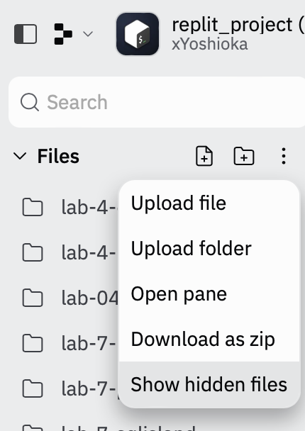
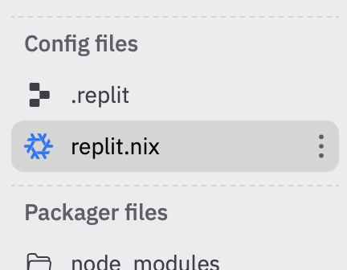
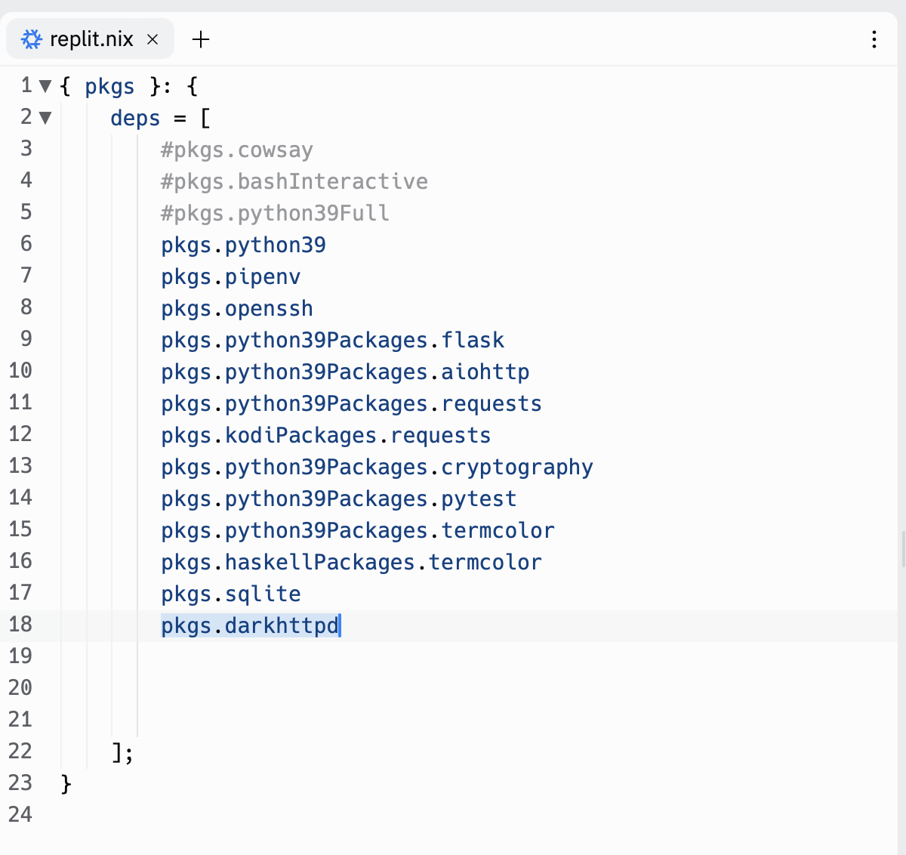
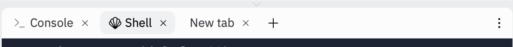
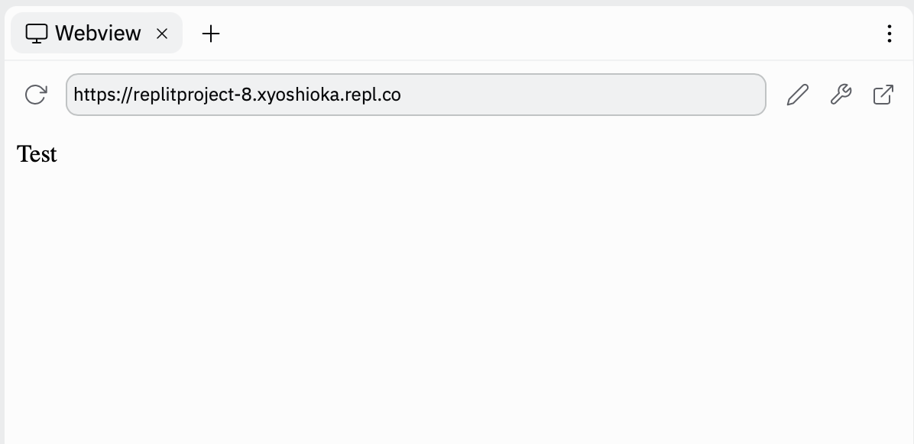

# Homepage

## Vorbereitung

In ELO finden Sie bei der dazugehörigen Aufgabe einen Link. Klicken Sie auf diesen, um mit der Bearbeitung der Aufgabe zu beginnen. Kehren Sie nach dem Öffnen der Seite zu dieser Anleitung zurück.

Link zu ELO/Moodle: [https://elearning.oth-regensburg.de](https://elearning.oth-regensburg.de)

Laden Sie sich den Startercode für die Aufgabe mit dem `get EXERCISE_NAME` Befehl in replit (OTH-Console) herunter. 

Bereiten Sie Replit für die Webentwicklung vor:
1. Klicken Sie auf die drei kleinen Punkte rechts neben dem Begriff "Files". Klicken Sie anschließend auf den erscheinenden Menüpunkt "Show hidden files" 

2. Suchen Sie die Datei `replit.nix`. Scrollen Sie hierzu runter - unter Ihre Lab-Aufgaben - bis zu dem Menüpunkt "Config Files".

3. Ergänzen Sie in der Datei `replit.nix` Folgendes, wie auf dem Screenshit unten zu sehen: pkgs.darkhttpd

## Specs

Die folgenden drei Sprachen, die Sie in dieser Sitzung kennengelernt haben, sind Bestandteil von fast jeder Website. Hierbei erfüllt jede einen anderen Zweck:
1. HTML - den Inhalt einer Website beschreiben
2. CSS - die Gestaltung einer Website beschreiben
3. JavaScript - einer Website Interaktivität und Dynmaik verleihen

Ihr Aufgabe ist es nun, eine einfache Homepage zu erstellen, die Sie selbst näher beschreibt. Diese kann beispielsweise ihren Namen, ihren Studiengang, ihr Hobby, ihre Lieblingsreiseziele oder irgendetwas anderes spannendes über Sie beinhalten. Ihrer Kreativität sind keine Grenzen gesetzt!

Ihre Homepage sollte mindestens 5 der folgenden Kriterien erfüllen:
1. Die Homepage beinhaltet vier verschiedene `.html` Seiten (eine davon ist `index.html`, die Startseite ihrer Website).
2. Von jeder `.html` Seite aus kann man zu jeder anderen `.html` Seite gelangen mittels einer Navigation.
3. Verwenden Sie mindestens 7 verschiedene HTML Tags (zusätzlich zu `<html>`, `<head>`, `<body>` und `<title>`). Wenn Sie einen Tag, wie z.B. `
` mehrere Male verwenden, zählt dies nur als einer der 7 zu verwendenden Tags.
4. Integrieren Sie mindestens 1 Feature von Bootstrap in Ihre Website (hierzu zählt z.B. eine Navigation, ein Button oder eine Tabelle).
5. Erstellen Sie mindestens ein Stylesheet File, `styles.css`, welches mindestens 5 verschiedene CSS Selektoren verwendet (z.B. tag (`example`), class (`.example`) oder ID (`#example`)) und in welchen Sie mindestens 5 verschiedene CSS Eigenschaften verwenden, z.B. `font-size` oder `margin`.
6. Integrieren Sie mindestens ein Feature von JavaScript, um die Interaktivität Ihrer Website zu erhöhen. Sie können JavaScript beispielsweise verwenden, um einen alert oder um Interaktivität zu Buttons, Dropdowns oder Formularen hinzuzufügen. Seien Sie kreativ!

## Testen

Sehen Sie sich während der Entwicklung ihre Website immer wieder an und überprüfen Sie, ob der/die von Ihnen angedachte Inhalt/Funktionalität tatsächlich wie in Ihrer Vorstellung dargestellt wird.

Um sich Ihre Website anzeigen zu lassen, führen Sie folgende Schritte durch:
1. Wechseln Sie bei Replit in die Shell.

2. Wechseln Sie in der Shell mithilfe des Befehls `cd` in Ihren Ordner für Lab 8.
3. Geben Sie folgenden Befehl ein: 
~~~shell
darkhttpd .
~~~
**Achtung:** Geben Sie auch das Leerzeichen nach darkhttpd und den Punkt danach ein!
4. Es öffnet sich die Webview. Klicken Sie auf den Button mit dem Pfeil rechts außen, um die Website in einem neuen Tab zu öffnen. Wenn Sie nun Änderungen in Ihrem Code vornehmen, können Sie die Website im neuen Tab einfach aktualisieren und die Änderungen werden Ihnen beinahe sofort angezeigt.

Überprüfen Sie auch die Validität Ihres HTML-Codes mit W3C: [https://validator.w3.org/#validate_by_input](https://validator.w3.org/#validate_by_input)
Beseitigen Sie eventuelle Warnings oder Errors vor der Abgabe.

Achten Sie auch darauf, dass die Gestaltung Ihrer Website für Benutzer intuitiv ist und sie einfach navigieren können.

Ihr CSS sollte in mindestens ein separates `.css`-File ausgelagert sein.

## Abgabe

Geben Sie Ihr Programm mit dem folgenden Befehl auf der OTH-Console ab:

    submit EXERCISE_NAME

Hinweis: Sie können den obigen Befehl so oft ausführen wie Sie wollen. Bewertet wird immer der mit dem letzten Befehl hochgeladene Code.

## Punktevergabe

Sie können für diese Aufgabe maximal 10 Punkte erhalten. Die Punktvergabe richtet sich nach der Anzahl der erfüllten Kriterien. 

Zusätzlich muss ihr HTML Code valide sein und darf keine Warnings oder Errors erhalten, wenn dieser mit W3C überprüft wird.

Basierend auf CS50 von David J. Malan (Harvard University, 2022).

[Impressum Digital Skills](https://tutors.dev/course/technological-skills)