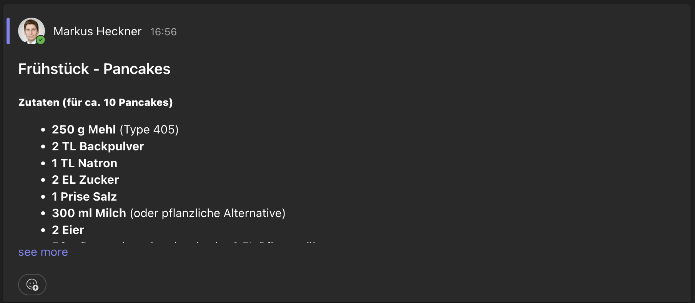

# Lieblingsrezepte
In dieser Aufgabe geht es um Rezepte: In einem Channel in Teams können Studierende ihre Lieblingsrezepte posten. Entwickeln Sie einen Workflow in Power Automate, um über Rezepte benachrichtigt zu werden, für die Sie sich interessieren.

Ein Rezept wird als neuer "Post" in diesem Kanal wie folgt erstellt: 

Der **Betreff der Nachricht** muss wie folgt aufgebaut sein: ```[Art der Mahlzeit] - [Name des Rezepts]``` Die Art der Mahlzeit muss dabei in der folgenden Auswahl enthalten sein:

* Frühstück

* Mittagessen
* Abendessen
* Snack
* Dessert

Beispiele für einen korrekten Betreff:

* Frühstück - Pancakes
* Abendessen - Spaghetti Carbonara
* Mittagessen - Züricher Geschnetzeltes 

Der **Inhalt** der Nachricht sollte das Rezept enthalten, kann aber ansonsten frei gestaltet werden.

Der folgende Screenshot zeigt einen Beispiel:




## Vorbereitung
1. Loggen Sie sich mit Ihrem OTH-Account bei Power Automate ein: https://make.powerautomate.com/
2. Loggen Sie sich bei Microsoft Teams (ebenfalls mit Ihrem OTH-Account) ein (https://teams.microsoft.com/v2/) und klicken dort auf das Team "OTH_IM_DigitalSkills_Students"
3. Klicken Sie dort unter Hauptkanäle auf "Lieblingsrezepte"

Wenn Sie den Kanal Lieblingsrezepte sehen, ist alles korrekt eingerichtet, und Sie können loslegen.

## Specs
* Erstellen Sie **einen** Flow in Power Automate, der Sie bei neuen Rezepten einer bestimmten Art per Mail informiert. Sie entscheiden dabei selbst, ob Sie sich über Rezepte der Kategorie Frühstück, Mittagessen, etc. informieren lassen wollen.
* Der Flow muss jedesmal eine neue Benachrichtigung erstellen, wenn ein neues Rezept im Kanal gepostet wird (bestehende Rezepte können Sie ignorieren)
* Sie geben im Flow an, über welche Art von Rezepten Sie informiert werden wollen. Über alle weiteren Rezepte, die nicht dieser Art entsprechen, werden Sie nicht informiert.


**Tipps:**

* Verwenden Sie den Auslöser "Wenn eine neue Kanalnachricht eingetroffen ist" und die Aktion "E-Mail Benachrichtigung erhalten"
* Es kann mehrere Minuten dauern, bis Sie eine Benachrichtigung erhalten.
* Denken Sie daran Ihren Workflow zu deaktivieren, wenn Sie keine Benachrichtigungen mehr erhalten wollen.

## Testen

* Testen Sie mit einigen Beispielposts, ob Ihr Benachrichtigungsdienst korrekt funktioniert, d.h. Sie erhalten eine Benachrichtigung für die Art von Rezepten, für die Sie sich interessieren, über alle anderen Rezepte werden Sie nicht benachrichtigt.

## Abgabe
* Erstellen Sie ein kurzes Video als Demo Ihres Flows (z.B. mit Zoom). In dieser Demo erläutern Sie den von Ihnen erstellten Flow in Power Automate und demonstrieren kurz, wie Sie einen Post erstellen und eine Benachrichtigung erhalten. 

## Punktevergabe
Sie können für diese Aufgabe maximal X Punkte erhalten. Die Punktvergabe richtet sich nach der Anzahl der korrekt durchlaufenden Testfälle. Sie können dies selbst mit dem check-Befehl überprüfen.

