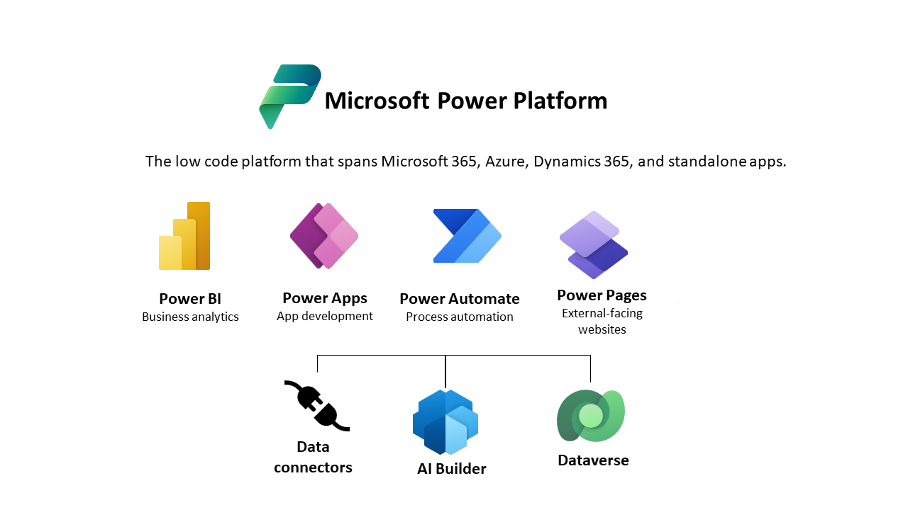
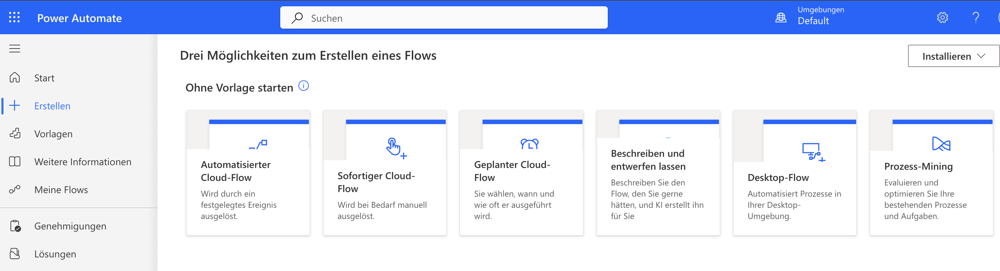

Note Challenge

Automation

[[toc]]

# Automation mit Power Automate
Was ist Power Automate?
* **Power Automate** ist ein **Automatisierungstool** von Microsoft.
* Es ermöglicht die **Automatisierung von Aufgaben** und **Workflows**, z. B. das Versenden von E-Mails oder das Synchronisieren von Daten zwischen verschiedenen Anwendungen.
* Es funktioniert mit **vielen Microsoft-Diensten** wie Excel, Outlook, SharePoint, sowie **Drittanbieter-Apps** (z. B. X, Google Drive, Gmail).
* **Keine Programmierkenntnisse** erforderlich – es verwendet eine **grafische Oberfläche** für die Erstellung von Workflows (= Flows). Denken wie ein Programmierer hilft aber bei der Erstellung von Flows!
* **Zahlreiche Vorlagen** und **vorgefertigte Workflows** erleichtern den Einstieg.
* Es kann **manuelle Prozesse** ersetzen, wodurch Zeit gespart und **Fehler reduziert** werden.

Power Automate ist Teil der Microsoft Power Platform.

Quelle: https://learn.microsoft.com/de-de/power-apps/maker/data-platform/data-platform-intro

## Einfache Flows
Einen neuen Flow können Sie bei Power Automate über den Link "+ Erstellen" in der Navigation erzeugen, vgl. die folgende Abbildung:

## Connectors

Eine Auswahl von Anwendungen mit denen sich Power Automate verbinden kann:

* **Sharepoint-Listen** - Webbasierte Listen aus Spalten und Zeilen, in denen sich Daten manuell oder automatisiert speichern lassen.

* **Dropbox** - Clouddienst zum Ablegen und Teilen von Dateien.

* **Dynamics** - CRM System von Microsoft zum Verwalten von Kundendaten.

* **Excel Online**

* **Google Dienste** z.B. Gmail, Google Drive, Google Sheets, Google Tasks

* **Jira**

* **Microsoft Dataverse** - Daten in der Microsoft Cloud speichern.

* **Microsoft Teams**

* **Notion** - Datenbankunterstütztes Wikitool

* **One Drive** - Clouddienst zum Ablegen und Teilen von Dateien von Microsoft.

* **One Note**

* **Planner**

* **Slack**

* **Survey Monkey**

* **Trello**

* **Vimeo**

* **X**

* **Youtube**

* **Zoom**

  

Vollständige laufend aktualisierte Liste hier: https://learn.microsoft.com/en-us/connectors/connector-reference/connector-reference-powerautomate-connectors

## Trigger

## Bedingungen

## Schleifen

## Funktionen

## Approval Workflows

## Demo AI Workflow mit Bilderkennung

Idee: Für einen Katalog werden Bilder verwendet, die bisher immer manuell beschrieben wurden. Der Workflow soll dabei helfen die Bilder automatisiert zu beschreiben.

**Trigger**: OneDrive - Wenn eine Datei erstellt wurde

**Aktion:** Beschreibung eines Bilds generieren

**Aktion:** SharePoint Liste - Element erstellen

## Demo: Todos erstellen auf Basis von Nachrichten in einem Teams Channel

Idee: Entwicklung eines Tools, das Teams dabei unterstützt eine gemeinsame Aufgabenliste aus einem Teams-Channel heraus per Nachrichten zu steuern.

Features:

* Erstellen einer neuen Nachricht in einem Channel, die den Begriff "todo:" im Titel enthält, die beispielsweise die Folgende: "Todo: Projektrisiken dokumentieren"
* Erstellen einer neuen Aufgabe, mit dem Text des Titels (Ohne "Todo:") in einer Aufgabenliste in Teams
* Erstellen einer E-Mailbenachrichtigung: XYZ hat soeben eine Aufgabe erstellt.

Ideen:

* OCR - Text aus Rechnung extrahieren?

Infos:

* Mit Compose / Verfassen kann man sich Texte zur Wiederverwendung erstellen
* 

Mails testen:

* https://temp-mail.org/de/

  
