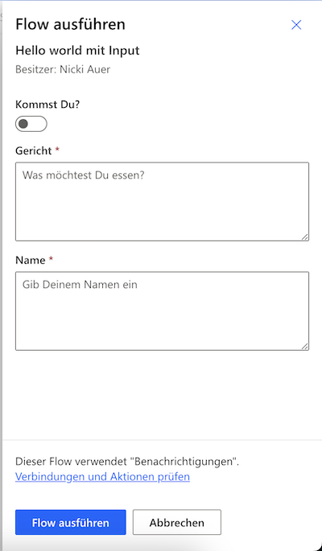

Note Challenge

Automation

[[toc]]


# Automation mit Power Automate
Was ist Power Automate?
* **Power Automate** ist ein **Automatisierungstool** von Microsoft.
* Es ermöglicht die **Automatisierung von Aufgaben** und **Workflows**, z. B. das Versenden von E-Mails oder das Synchronisieren von Daten zwischen verschiedenen Anwendungen.
* Es funktioniert mit **vielen Microsoft-Diensten** wie Excel, Outlook, SharePoint, sowie **Drittanbieter-Apps** (z. B. X, Google Drive, Gmail).
* **Keine Programmierkenntnisse** erforderlich – es verwendet eine **grafische Oberfläche** für die Erstellung von Workflows (= Flows). Denken wie ein Programmierer hilft aber bei der Erstellung von Flows!
* **Zahlreiche Vorlagen** und **vorgefertigte Workflows** erleichtern den Einstieg.
* Es kann **manuelle Prozesse** ersetzen, wodurch Zeit gespart und **Fehler reduziert** werden.

Power Automate ist Teil der Microsoft Power Platform.


Quelle: https://learn.microsoft.com/de-de/power-apps/maker/data-platform/data-platform-intro

# Zugriff auf Power Automate

Sie haben mit Ihrem Studierendenaccount bereits Zugriff auf Power Automate und können sich direkt dort einloggen: https://make.powerautomate.com/

## Connectors

Eine Auswahl von Anwendungen mit denen sich Power Automate verbinden kann:

* **Sharepoint-Listen** - Webbasierte Listen aus Spalten und Zeilen, in denen sich Daten manuell oder automatisiert speichern lassen.
* **Dropbox** - Clouddienst zum Ablegen und Teilen von Dateien.
* **Dynamics** - CRM System von Microsoft zum Verwalten von Kundendaten.
* **Excel Online**
* **Google Dienste** z.B. Gmail, Google Drive, Google Sheets, Google Tasks
* **Jira**
* **Microsoft Dataverse** - Daten in der Microsoft Cloud speichern.
* **Microsoft Teams**
* **Notion** - Datenbankunterstütztes Wikitool
* **One Drive** - Clouddienst zum Ablegen und Teilen von Dateien von Microsoft.
* **One Note**
* **Planner**
* **Slack**
* **Survey Monkey**
* **Trello**
* **Vimeo**
* **X**
* **Youtube**
* **Zoom**

Vollständige laufend aktualisierte Liste hier: https://learn.microsoft.com/en-us/connectors/connector-reference/connector-reference-powerautomate-connectors

## Hello World
Einen neuen Flow können Sie bei Power Automate über den Link "+ Erstellen" in der Navigation erzeugen, vgl. die folgende Abbildung:


Im folgenden Beispiel soll eine einfache Hello World Demo erstellt werden, die eine Benachrichtung per Mail sendet, sobald die User auf einen Button klicken.

Dazu: **Sofortiger Cloudflow wählen** - Dies ist der Auslöser (**Trigger** für Ihren Workflow). Sie können Workflows auch automatisch auslösen, z.B. wenn Sie eine Mail erhalten.

In der Bearbeitungsansicht des Flows kann durch Klick nach dem Start des Flows eine Aktion hinzugefügt werden (E-Mail Benachrichtigung erhalten). Die Felder Betreff und Textkörper können angepasst werden, um den Inhalt der Benachrichtigung zu individualisieren:


Anschließend den Workflow speichern und Testen. Achtung: Es kann mehrere Minuten dauern, bis Sie die Benachrichtigung erhalten.

## Eingaben
In Power Automate können Sie Eingaben aus vorhergehenden Schritten in späteren Schritten wieder verwenden. Das Hello World Beispiel lässt sich so anpassen, dass im Trigger eine Eingabe der Nutzer verlangt wird.

Im Folgenden soll ein Flow für eine Anmeldung zum Abendessen erstellt werden, der nur eine Benachrichtigung verschickt, wenn ein Nutzer zum Essen kommen kann.

Dazu wieder einen Workflows mit einem manuellen Trigger erzeugen. Anschließend kann man durch Klick auf den Trigger weitere Daten von den Benutzern abfragen, vgl. folgender Screenshot.


Erstellen Sie die Parameter wie dargestellt und Testen anschließend Ihren Flow:



Die Eingaben aus Schritten eines Flows lassen sich in späteren Schritten wieder auslesen und weiterverwenden. In diesem Beispiel sollen die Informationen aus dem manuellen Trigger verwendet werden, um eine Bestätigungsmail zu verschicken. Klickt man auf die Aktion "E-Mail Benachrichtigung erhalten", lässt sich die Mail um Bausteine des vorherigen Schritts erweitern. Klickt man dazu in den Feldern Betreff oder Textkörper auf das blaue Blitzsymbol, öffnet sich ein Dialogfeld, und die Daten aus dem vorherigen Schritt lassen sich als Platzhalter einfügen.


Die dann versendete Benachrichtigung sollte dann wie folgt aussehen:


## Bedingungen

Die Benachrichtigung aus dem vorhergehenden Schritt wird jetzt immer versendet, diese soll aber nur versendet werden, wenn die User unter "Kommst Du?" ja gewählt haben, bzw. den Schalter eingeschaltet haben. Dazu kann ein neuer Schritt durch Klick auf das +-Zeichen und Auswahl von "Aktion hinzufügen" hinzugefügt werden. In der Suche kann jetzt nach "Bedingung gesucht werden". Die Bedingung erscheint daraufhin im Flow. Um die Benachrichtigung nur an Nutzer zu versenden, die auch kommen können, auf die Bedingung klicken und diese mit den Daten aus dem vorhergehenden Schritt befüllen und anschließend die Aktion zum Versenden in den Zweig "TRUE" der Bedingung verschieben. Das Ergebnis sieht wie folgt aus:


## Debugging
Um Fehler in einem Flow zu finden, lassen sich diese mit Power Automate debuggen. Dabei kann jeder einzelne Schritt des Flows überprüft werden, um den Grund für den Fehler zu finden. Im Folgenden Beispiel wird die Benachrichtigung nicht versandt, obwohl die Bedingung augenscheinlich korrekt implementiert wurde. Der Flow will eine Mail verschicken, wenn die Nutzer angeben, dass Sie kommen wollen. Dazu wird geprüft, ob in der Eigenschaft "Kommst Du?" der Wert "Ja" steht:


Testet man den Flow, kann man die Ausührung ansehen und erhält eine Abbildung wie die Folgende (dazu unter Meine Flows den Flow auswählen und auf der nächsten Seite unter Ausführungsverlauf auf das Datum der letzten Ausführung klicken):


Die grünen Häkchen zeigen, dass der Flow ausgelöst wurde und die Bedingung geprüft wurde. Ebenfalls wird ersichtlich, dass der Zweiug TRUE nicht ausgeführt wurde. Klickt man jetzt auf den Schritt vor der Bedingung (d.h. dahin wo die Daten zur Überprüfung der Bedingung herkommen sollen), dann wird unter "EINGABEN" ersichtlich, dass der Wert von "Kommst Du?" nicht "Ja" sondern ```true``` ist, die Prüfung der Bedingung kann also nicht wahr werden, da "Ja" nicht gleich ```true``` ist:

Um das Problem zu beheben, muss die Prüfung der Bedingung auf ```true```angepasst werden, damit Prüfung und Daten aus dem vorhergehenden Schritt übereinstimmen.

## Schleifen

## Funktionen

## Approval Workflows

## Demo AI Workflow mit Bilderkennung

Idee: Für einen Katalog werden Bilder verwendet, die bisher immer manuell beschrieben wurden. Der Workflow soll dabei helfen die Bilder automatisiert zu beschreiben.

**Trigger**: OneDrive - Wenn eine Datei erstellt wurde

**Aktion:** Beschreibung eines Bilds generieren

**Aktion:** SharePoint Liste - Element erstellen


## Demo: Todos erstellen auf Basis von Nachrichten in einem Teams Channel

Idee: Entwicklung eines Tools, das Teams dabei unterstützt eine gemeinsame Aufgabenliste aus einem Teams-Channel heraus per Nachrichten zu steuern.

Features:

* Erstellen einer neuen Nachricht in einem Channel, die den Begriff "todo:" im Titel enthält, die beispielsweise die Folgende: "Todo: Projektrisiken dokumentieren"
* Erstellen einer neuen Aufgabe, mit dem Text des Titels (Ohne "Todo:") in einer Aufgabenliste in Teams
* Erstellen einer E-Mailbenachrichtigung: XYZ hat soeben eine Aufgabe erstellt.


Ideen:

* OCR - Text aus Rechnung extrahieren?


Infos:

* Mit Compose / Verfassen kann man sich Texte zur Wiederverwendung erstellen
* 

Mails testen:

* https://temp-mail.org/de/

  
