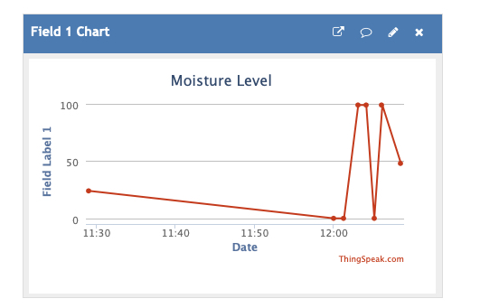

# Pflanzensensor

## Vorbereitung

Zur Durchführung dieser Aufgabe benötigen Sie den Micro:Bit und das dazugehöroge IoT Package (Lichtsensor, PIR-Sensor (= Bewegungssensor), Bodenfeuchtesensor, Kabel). Außerdem sollte Ihnen eine externe Stromquelle zur Verfügung stehen, an welcher Sie das USB-Netzteil des IoT-Kits anstecken können.

Die Aufgabe können Sie auf der [Micro:Bit Website](https://makecode.microbit.org/#editor) bearbeiten.

## Specs

In dieser Lab-Aufgabe geht es darum, einen Pflanzensensor zu entwickeln. Wenn tagsüber im Raum, in dem sich die Pflanze befindet, Bewegung erkannt wird und die Bodenfeuchtigkeit unter einen gewissen Schwellwert gesunken ist, soll eine Melodie abgespielt werden, die uns daran erinnern soll, die Pflanze zu gießen. Außerdem soll das Gerät jede Minute den aktuellen Bodenfeuchtewert und die aktuelle Helligkeit im Raum an den ThingSpeak-Server schicken.

### Kriterien:

1. Verwenden Sie den PIR-Sensor, um die Bewegung zu erkennen. So wird verhindert, dass die Melodie abgespielt wird, wenn niemand zu Hause ist.
2. Verwenden Sie den Bodefeuchte-Sensor, um die Feuchtigkeit zu ermitteln. Der Sensor liefert einen Wert zwischen 0 und 100. Sie müssen selbst herausfinden, was ein geeigneter Schwellwert ist, ab dem das Gießen notwendig ist.
3. Verwenden Sie den Lichtsensor, um herauszufinden, ob gerade Tag oder Nacht ist. In der Nacht soll keine Melodie abgespielt werden.
4. Verbinden Sie den iot:bit mit dem WLAN und schicken Sie alle 60 Sekunden die Bodenfeuchte- und Lichtstärke-Daten an den ThingSpeak-Server, damit Sie sich die Verläufe über einen längeren Zeitraum grafisch anschauen können.

Natürlich können Sie Ihren Pflanzensensor noch um weitere coole Features erweitern, sodass er Sie z. B. nur höchstens einmal pro Stunde warnt oder zusätzlich oder anstelle der Melodie ein Symbol auf dem Display anzeigt.

Wenn Sie keine WLAN-Zugangsdaten besitzt, können Sie auch mit Ihrem Handy einen Hotspot eröffnen und den iot:bit mit dem Hotspot verbinden. Wenn Sie in der OTH in Gebäude K sind, können Sie den iot:bit mit dem Netzwerk “TI Roboter” verbinden. Das WLAN-Passwort dazu finden Sie im ELO-Kurs bei "Abgabe - Challenge 10 - IoT".

## Testen

Übertragen Sie Ihr Programm auf den Micro:Bit (siehe Note Challenge 10) und testen Sie, ob das Programm die oben genannten Kriterien erfüllt.

## Abgabe

Wenn Ihr Programm einwandfrei funktioniert, laden Sie bitte **drei** Screenshots / Fotos im ELO-Kursraum hoch:
- **Programmcode**, auf welchem die bunten Blöcke ihres Programms der Website erkennbar sind (*Vorsicht: Entfernen Sie vor der Abgabe ihr WLAN-Passwort oder machen Sie es unkenntlich!*)
- **Aufbau**, auf welchem der Aufbau des Micro:Bits und der Sensoren vor Ihnen grob erkennbar ist
- **Datenausgabe**, auf welchem ein Diagramm der Daten über einen längeren Zeitraum zu sehen ist (ThingSpeak), z.B.:

Link zu Moodle: [https://elearning.oth-regensburg.de](https://elearning.oth-regensburg.de)

Weitere Informationen zur Abgabe finden Sie in ELO.

## Erfolgskriterium 

Die Aufgabe gilt als bestanden, wenn 3 der 4 oben genannten Kriterien erfolgreich umgesetzt wurden und die drei benötigten Screenshots / Fotos abgegeben wurden.

