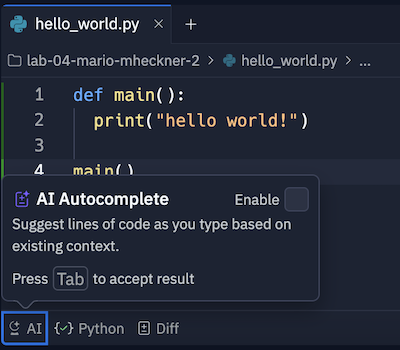

# Codespaces konfigurieren konfigurieren

Um Code zu schreiben, werden Sie in den folgenden Challenges vorrangig Codespaces von GitHub verwenden. Sie benötigen dafür einen GitHub Account. GitHub wird von Einzelpersonen oder Teams verwendet, um zusammen an Code zu arbeiten und Änderungen daran zu verfolgen.

Führen Sie die folgenden Schritte einmalig durch, um die browserbasierte IDE Codespaces einzurichten:

1. Registrieren Sie sich Ihrer studentischen E-Mail-Adresse bei [https://github.com/](https://github.com/)
2. Öffnen Sie [https://github.com/codespaces/](https://github.com/codespaces/), loggen sich ein, falls noch nicht geschehen, und klicken Sie auf den Button  "New codespace"
3. Klicken Sie bei Repository auf den Button "Select a repository" und kopieren den folgenden Text in das Eingabefeld: ```/OTH-Digital-Skills-Student-Submissions/tech-skills-ws24-general-template-codespace``` und klicken dann unter das Eingabefeld auf den ersten Eintrag (dort steht ebenfalls der Text).
4. Erstellen Sie den codespace durch Klick auf "Create codespace"

Ihr neuer codespace sollte sich jetzt selbständig konfigurieren und automatisch gestartet werden.

codespace ist eine webbasierte IDE, mit der Sie Code schreiben, ausführen und debuggen können.

Replit ist in die folgenden drei Bereiche unterteilt:

1. **Files** (auf der linken Seite) - Zeigt Ordner und Dateien an. Klickt man auf eine Datei wird diese im **Texteditor** geöffnet.
2. **Texteditor** (mittig) - Hier schreiben Sie Ihren Code
3. **Console** - Hier geben Sie die Befehle zum Ausführen Ihrer Programme und zum wechseln von Ordnern ein.

Tippen Sie in der Console den folgenden Befehl ein, gefolgt von Enter, um einen neuen Ordner zu erstellen:

~~~shell
mkdir hello_world
~~~

Vergessen Sie nicht das Leerzeichen zwischen ```mkdir``` und ```hello_world```. Auf diese Art und Weise (d.h. eine Zeile, gefolgt von der Taste Enter) geben Sie alle Befehle in die Console ein. Alle Befehle sind "case-sensitive", d.h. die Groß- und Kleinschreibung muss genau so sein wie in den Beispielen angegeben.

Geben Sie jetzt den folgenden Befehl ein (wieder gefolgt von Enter), um in den neu erstellten Ordner zu wechseln:

~~~shell
cd hello_world
~~~

Die Console sollte in etwas so aussehen und somit anzeigen, dass Sie den Ordner erfolgreich gewechselt haben:

~~~shell
OTH-Console:~/.../hello_world> 
~~~

Erstellen Sie mit dem folgenden Befehl Ihr erstes Programm:

~~~python
touch hello_world.py	
~~~

Im Bereich Files (auf der linken Seite) können Sie jetzt sehen, dass eine neue leere Datei erstellt wird. Klicken Sie auf diese Datei, um diese im Texteditor zu öffnen.

Tippen Sie auf der Console den folgenden Befehl ein, um sich alle Dateien im Ordner ```hello_world``` anzeigen zu lassen:

~~~shell
ls
~~~

Die Ausgabe sollte wie folgt sein (die Datei ```hello_world.py``` haben Sie zuvor mit ```touch hello_world.py``` angelegt):

~~~shell
ls
hello_world.py
OTH-Console:~/.../hello_world> 
~~~

Erstellen Sie jetzt Ihr erstes Programm: Tippen Sie dazu den folgenden Code in den Texteditor, exakt so, wie hier dargestellt:

~~~python
def main():
  print("hello world!")

main()
~~~

Tippen Sie den folgenden Befehl in der Console, um zu Testen, ob alles wie erwartet funktioniert:

~~~shell
python hello_world.py 
~~~

Ihr Programm sollte die folgende Ausgabe erzeugen:

~~~shell
hello world!
~~~

Glückwunsch! Sie haben replit erfolgreich eingerichtet und ihr erstes Python-Programm geschrieben!

Standardmäßig ist in Replit die Funktion "AI Autocomplete" aktiviert. Diese schlägt automatisch Optionen zur Vervollständigung ihres Codes auf Basis von Kommentaren und bestehendem Code vor. Wir empfehlen Ihnen **dringend**, diese Funktion zu deaktivieren, wenn sie wirklich etwas über Programmierung lernen wollen.

Öffnen Sie dazu die Datei ```hello_world.py``` und klicken für am unteren Rand der Umgebung auf "AI". Entfernen Sie hier den Haken neben "Enable", wie auf dem Screenshot zu sehen.



**Tipp:** Der Button "Run" konfiguriert replit so, dass Sie auf der Console arbeiten können. Wenn Sie oben in replit einen Button "Stop" sehen passt alles, wenn der Button wieder auf "Run" wechselt, müssen Sie ihn erneut drücken.  
